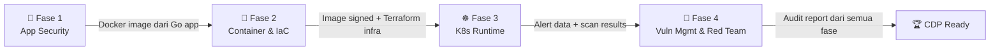

# 🛡️ 60 Days DevSecOps Mastery Challenge

> Membangun **SecureBank API** — sebuah REST API perbankan berbasis Golang yang diamankan secara bertahap dari kode mentah hingga *production-grade* di Kubernetes selama 60 hari.

---

## 📌 Tentang Challenge Ini

Challenge ini adalah program belajar mandiri selama **60 hari** yang dirancang untuk menguasai praktik **DevSecOps** secara menyeluruh melalui satu proyek utuh yang saling terhubung.

Bukan sekadar teori — setiap hari menghasilkan **output konkret** yang langsung bisa dilihat dan diuji.

```
Kode Go → Pipeline CI/CD → Container → Terraform Infra → Kubernetes → Monitoring → Red Team → Audit
```

---

## 🗺️ Peta Belajar

| Fase | Topik | Hari | Tools Utama |
|------|-------|------|-------------|
| 🔐 **Fase 1** | Secure SDLC & Application Security | 1–15 | Gitleaks, Trivy, Semgrep, GitHub Actions |
| 🐳 **Fase 2** | Infrastructure as Code & Container Security | 16–30 | Docker, Cosign, Terraform, Checkov, OWASP ZAP |
| ☸️ **Fase 3** | Kubernetes & Runtime Security | 31–45 | k3d, OPA Gatekeeper, Falco, RBAC, n8n |
| 🔴 **Fase 4** | Vulnerability Management & Red Teaming | 46–60 | DefectDojo, Prowler, CloudTrail, CDP Exam Sim |

---

## 🏗️ Proyek Utama: SecureBank API

Satu proyek yang digunakan dari awal hingga akhir:

- **Bahasa:** Golang
- **Fitur:** Transfer, cek saldo, riwayat transaksi
- **Target akhir:** Berjalan di Kubernetes dengan full security pipeline

### Struktur Repositori (Target Akhir Hari ke-60)

```
securebank-api/
├── cmd/api/main.go
├── internal/
│   ├── handler/
│   ├── middleware/
│   ├── model/
│   ├── repository/
│   └── service/
├── pkg/crypto/
├── configs/
├── Dockerfile
├── docker-compose.yml
├── Makefile
├── .github/workflows/
│   ├── ci.yml
│   ├── security-scan.yml
│   └── infra.yml
├── terraform/
├── k8s/
│   ├── deployment.yaml
│   ├── network-policy.yaml
│   ├── rbac.yaml
│   └── gatekeeper/
├── security/
│   ├── falco-rules/
│   ├── inspec-profiles/
│   ├── threat-model/
│   └── audit-reports/
└── docs/
```

---

## 📊 Progress

> **Dimulai:** 2026-06-05 | **Target Selesai:** 2026-08-03

| Fase | Status | Selesai |
|------|--------|---------|
| 🔐 Fase 1 — Secure SDLC & AppSec | ✅ Selesai | 15/15 |
| 🐳 Fase 2 — IaC & Container Security | ✅ Selesai | 15/15 |
| ☸️ Fase 3 — K8s & Runtime Security | ✅ Selesai | 15/15 |
| 🔴 Fase 4 — Vuln Mgmt & Red Team | 🔄 Berjalan | 13/15 |
| **Total** | | **58 / 60** |

Branching dan aturan merge: [`docs/branching-and-merge-policy.md`](docs/branching-and-merge-policy.md).

📁 **Lihat catatan harian & retrospektif di folder [`progress/`](progress/README.md)**

---

## 🧰 Prasyarat

| Komponen | Versi Minimum |
|----------|--------------|
| OS | macOS / Linux (WSL2 untuk Windows) |
| Go | v1.22+ |
| Docker | v24+ dengan Docker Compose |
| Git | v2.40+ |
| kubectl | v1.28+ |
| Helm | v3.14+ |
| Terraform | v1.7+ |
| IDE | VS Code dengan Go extension |
| Cloud | AWS Free Tier atau GCP Free Tier |
| CI/CD | GitHub Account (GitHub Actions) |

---

## 📚 Dokumentasi per Fase

| File | Deskripsi |
|------|-----------|
| [`sylabus.md`](sylabus.md) | Kurikulum lengkap 60 hari |
| [`docs/fase-1-appsec.md`](docs/fase-1-appsec.md) | Detail tutorial Fase 1 |
| [`docs/fase-2-infra-container.md`](docs/fase-2-infra-container.md) | Detail tutorial Fase 2 |
| [`docs/fase-3-k8s-runtime.md`](docs/fase-3-k8s-runtime.md) | Detail tutorial Fase 3 |
| [`docs/fase-4-vuln-redteam.md`](docs/fase-4-vuln-redteam.md) | Detail tutorial Fase 4 |
| [`docs/istilah-asing.md`](docs/istilah-asing.md) | Glosarium istilah teknis DevSecOps |

---

## 🔗 Koneksi Antar Fase



**Benang merah:**
1. **SecureBank API** ditulis di Fase 1 → menjadi target scan di semua fase
2. **Pipeline CI/CD** dibangun di Fase 1 → ditambah jobs di Fase 2–4
3. **Docker image** di-build Fase 2 → di-deploy ke K8s di Fase 3
4. **Falco alerts** di Fase 3 → dikirim ke n8n/Slack di Fase 4
5. **Semua hasil scan** → masuk DefectDojo → jadi laporan audit final

---

## 🎯 Target Milestone

- [x] **Hari 15** — Pipeline CI/CD dengan Secret Scan + SAST + SCA berjalan otomatis
- [x] **Hari 30** — Docker hardened + IaC Terraform + DAST live di pipeline
- [ ] **Hari 45** — K8s cluster dengan OPA Gatekeeper + Falco + RBAC audited
- [ ] **Hari 60** — Laporan audit lengkap + CI/CD showcase dan cleanup selesai

---

## 📖 Cara Menggunakan Repo Ini

```bash
# Clone repositori
git clone https://github.com/stayrelevantid/chalange-devsecops.git
cd chalange-devsecops

# Mulai dari hari pertama — baca dulu silabus
cat sylabus.md

# Buka catatan hari yang sedang dikerjakan
cat progress/daily/hari-01.md

# Centang progres di tracker
cat progress/tracker.md
```

---

<div align="center">

**Dibangun dengan 💪 sebagai perjalanan belajar DevSecOps selama 60 hari**

*Setiap hari satu langkah — setiap langkah membangun ke atas langkah sebelumnya.*

</div>
