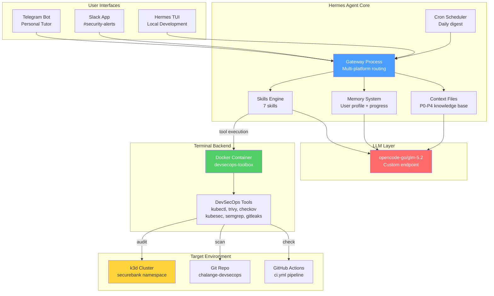

# Brainstorm: DevSecOps AI Assistant dengan Hermes Agent

> Dokumen ini berisi konsep dan arsitektur untuk membangun AI assistant DevSecOps menggunakan [Hermes Agent](https://github.com/NousResearch/hermes-agent) (Nous Research) berbasis knowledge base dari 60 Days DevSecOps Mastery Challenge — SecureBank API.

---

## 1. Vision & Goals

### Visi

Sebuah AI assistant yang **self-improving** dan **context-aware** untuk DevSecOps — bukan generic chatbot, tapi assistant yang "tahu" seluruh perjalanan 60-day challenge, bisa mengajar, mereview code, dan mengaudit cluster secara real-time.

### Mengapa Hermes Agent?

| Fitur Hermes | Relevansi untuk DevSecOps Assistant |
|-------------|-------------------------------------|
| **Self-improving learning loop** | Assistant belajar dari setiap interaksi — kalau user bertanya tentang Checkov dan assistant salah jawab, next session diperbaiki |
| **Memory + cross-session recall** | Track progress user ("Hari ke berapa? Fase apa yang lagi dikerjain?") |
| **Skills system** (agentskills.io) | Modular skills: tutor, reviewer, auditor — bisa dipakai bersamaan |
| **Terminal backend** (Docker/SSH) | Execute tools (kubectl, trivy, checkov) langsung dari chat |
| **Multi-platform messaging** | Telegram untuk personal tutor, Slack untuk team alerts |
| **Cron scheduling** | Daily security digest, scheduled cluster audit |
| **Model-agnostic** | Pakai opencode-go/glm-5.2 tanpa lock-in vendor |
| **Context files** | Feed knowledge base dari repo tanpa custom RAG pipeline |
| **MCP integration** | Extend dengan MCP servers untuk tool tambahan |

### Goals

1. **Tutor** — Jawab pertanyaan DevSecOps berdasarkan 60-day challenge (konsep, tool comparison, how-to commands)
2. **Reviewer** — Review code/config user, beri feedback security, suggest remediation mengikuti pattern dari challenge
3. **Auditor** — Execute DevSecOps tools (kubectl, trivy, checkov, kubesec) via terminal backend untuk audit K8s cluster real-time

### Non-Goals (untuk phase awal)

- Tidak menggantikan scanner tools (Trivy, Semgrep, Checkov) — assistant **memakai** tools, bukan menggantikan
- Tidak auto-remediate tanpa human approval — destructive commands butuh confirmation
- Tidak mendeploy ke production cluster — cluster audit hanya pada k3d local/dev

---

## 2. Persona & Use Cases

### Persona 1: DevSecOps Learner (Tutor Mode)

**Profile:** Sedang mengikuti 60-day challenge atau belajar DevSecOps mandiri.

**Example interactions:**

```
User: "Bedanya SAST vs DAST apa sih?"

Assistant: Berdasarkan challenge Day 8 vs Day 24:
- SAST (Static Application Security Testing) — analisis source code
  tanpa run app. Semgrep di Day 8 nemuin MD5 + SQL injection pattern.
  Cepat (~5s), tapi false positive dan tidak catch runtime issues.
- DAST (Dynamic Application Security Testing) — scan app yang sudah
  running. ZAP di Day 24 scan localhost:8080, test dari luar seperti
  attacker. Lebih realistis tapi slower (~30s).

Kesimpulan: keduanya complementary. SAST catch code-level issues,
DAST catch runtime/config issues. Pipeline challenge pakai keduanya
(SAST di job sast-scan, DAST di job dast-scan).

Mau lihat cara setup SAST di pipeline? Lihat docs/fase-1-appsec.md
bagian "Hari 9: SAST di Pipeline".
```

```
User: "Kenapa distroless image gak bisa exec sh?"

Assistant: Distroless image (gcr.io/distroless/static-debian12:nonroot)
tidak menyertakan shell (/bin/sh) — by design. Ini security feature:
kalau attacker dapat RCE, mereka tidak punya shell untuk pivot.

Dari challenge Day 18:
- Dockerfile pakai distroless → image 7.97MB, 0 CVE
- Trade-off: tidak bisa `kubectl exec -it sh` untuk debugging
- Mitigation: `kubectl debug` (ephemeral container dengan shell)

kubectl debug -it <pod-name> --image=busybox --target=<container-name>

Ini didokumentasikan di docs/pro-cons.md bagian "Distroless Container
Images".
```

### Persona 2: Security Engineer (Reviewer Mode)

**Profile:** Review code/config sebelum deploy, mau pastikan security best practices.

**Example interactions:**

```
User: [paste Dockerfile]

Assistant: Review Dockerfile berdasarkan pattern Day 18 challenge:

⚠️ Findings:
1. Root user — tidak ada USER directive. Distroless nonroot pakai
   UID 65532. Fix: USER 65532:65532
2. No read-only filesystem — tambah docker-compose: read_only: true
3. No resource limits — tambah deploy.resources.limits
4. Single-stage build — image ~350MB. Multi-stage (golang:alpine →
   distroless) = 7.97MB (44x smaller)

✅ Sudah bagus:
- COPY --chown sudah ada
- EXPOSE port defined

Referensi: securebank-api/Dockerfile (multi-stage hardened version)
```

```
User: [paste K8s deployment.yaml]

Assistant: Review berdasarkan Day 33 SecurityContext hardening:

⚠️ Missing:
1. securityContext.runAsNonRoot: true
2. securityContext.runAsUser: 65532 (distroless nonroot UID)
3. securityContext.seccompProfile.type: RuntimeDefault
4. container securityContext.allowPrivilegeEscalation: false
5. container securityContext.readOnlyRootFilesystem: true
6. container securityContext.capabilities.drop: ["ALL"]
7. resources.requests + limits (Gatekeeper akan deny tanpa ini!)
8. livenessProbe + readinessProbe
9. serviceAccountName (pakai dedicated SA, bukan default)
10. automountServiceAccountToken: false

Kubesec score estimasi: 0/12. Setelah fix: 12/12.

Mau saya generate YAML yang sudah hardened?
```

### Persona 3: Cluster Admin (Auditor Mode)

**Profile:** Mau audit K8s cluster security posture secara real-time.

**Example interactions:**

```
User: "Audit cluster securebank saya"

Assistant: Running audit... (executing via terminal backend)

[1/4] kubectl get pods --all-namespaces
→ 3 namespaces: securebank (2 pods), gatekeeper-system (2 pods),
  kube-system (3 pods). All Running.

[2/4] kubectl get networkpolicy -n securebank
→ 3 policies: default-deny-all, allow-api-ingress, allow-dns-egress
  ✅ Default deny pattern detected

[3/4] checkov -d k8s/ --framework kubernetes
→ 101 passed, 0 failed, 3 skipped
  ⚠️ Skipped: CKV_K8S_15 (imagePullPolicy), CKV_K8S_35 (secret as
  env), CKV_K8S_43 (image digest)

[4/4] kubesec scan k8s/deployment.yaml
→ Score: 12/14 (2 advise: AppArmor, SeccompAny)

Summary: Cluster security posture STRONG. 3 items untuk production
hardening: imagePullPolicy Always, External Secrets Operator untuk
secret management, image digest untuk supply chain.
```

---

## 3. Knowledge Base Strategy

### Source Files (Hermes Context Files)

Hermes Agent mendukung **context files** — file yang otomatis dimasukkan ke system prompt. Strategy: feed repo sebagai knowledge base tanpa custom RAG.

| Priority | File | Lines | Why |
|----------|------|-------|-----|
| **P0 (Core)** | `sylabus.md` | ~200 | 60-day curriculum overview, phase structure |
| **P0** | `docs/istilah-asing.md` | ~60 | Glossary DevSecOps dalam Bahasa Indonesia |
| **P0** | `docs/pro-cons.md` | ~150 | Technology trade-offs (distroless, dll) |
| **P1 (Fase docs)** | `docs/fase-1-appsec.md` | ~1140 | Tutorial + retrospective Fase 1 |
| **P1** | `docs/fase-2-infra-container.md` | ~1120 | Tutorial + retrospective Fase 2 |
| **P1** | `docs/fase-3-k8s-runtime.md` | ~860 | Tutorial Fase 3 (in progress) |
| **P2 (Comparisons)** | `security/k8s-scan-comparison.md` | ~100 | Kubesec vs Checkov vs Trivy |
| **P2** | `security/iac-scan-comparison.md` | ~100 | Checkov vs Trivy IaC |
| **P2** | `security/threat-model/architecture.md` | ~260 | STRIDE + DREAD threat model |
| **P3 (Daily logs)** | `progress/daily/hari-01.md` — `hari-38.md` | ~150 each | Real execution logs, errors, workarounds |
| **P3** | `progress/tracker.md` | ~115 | Progress overview |
| **P4 (Code)** | `securebank-api/` key files | varies | Working examples: main.go, Dockerfile, ci.yml, K8s manifests, Terraform |

### Context Window Management

Total P0+P1 docs ≈ 3500 lines. glm-5.2 context window menentukan strategy:

- **Full context mode** — semua P0+P1 dalam context files (kalau context window cukup)
- **Layered context** — P0 selalu loaded, P1/P2 loaded on-demand via skill triggers
- **Memory-based** — assistant baca file via terminal backend saat ditanya ("lihat hari-33.md untuk SecurityContext hardening details")

### Premium Knowledge: 20 Unique Insights

Insights dari challenge yang tidak ada di vendor docs — ini yang membuat assistant **uniquely valuable**:

1. `.gitignore` bukan security boundary — `git add -f` bypass, Gitleaks `--no-gitignore` flag tidak ada
2. Scanner output ≠ real security — AI audit nemuin 5 issues yang Trivy+Semgrep lewatkan
3. JWT Authentication ≠ Authorization — auth tanpa authz = anyone bisa akses anyone's balance
4. `math.IsInf`/`math.IsNaN` untuk financial API — `amount > 0` tidak cukup
5. `http.NewServeMux()` + Handler wrapper — 404 responses juga butuh security headers
6. Distroless kills Dockerfile HEALTHCHECK — pakai K8s liveness probe
7. ZAP Rule 10049 false positive untuk API — `continue-on-error: true`
8. Go binary approach untuk DAST CI > Docker build (~5s vs ~30s)
9. Checkov vs Trivy complementary, bukan competing
10. Cosign non-interactive: `COSIGN_PASSWORD=""`
11. InSpec 7.x gem tidak ada CLI — pakai `brew install --cask`
12. rakkess repo 404 → access-matrix krew plugin
13. `default` SA = no accountability → dedicated SA + `resourceNames`
14. `automountServiceAccountToken: false` + dedicated SA = defense in depth
15. 3 RBAC audit tools, 3 use cases (who-can, access-matrix, auth can-i)
16. Intentional vuln testing validates defense layers
17. Pipeline caching saves 30-40%
18. `prevent_destroy = true` — AI review catch, scanner miss
19. Threat modeling bridges scanner vs manual review gap
20. "Benang merah" philosophy — continuous project > isolated labs

### Memory Strategy

Hermes memory system dipakai untuk:

- **User profile** — "User sedang di Day 38, Fase 3, fokus K8s security"
- **Learning progress** — track hari yang sudah selesai, konsep yang sudah dipelajari
- **Q&A history** — kalau user sudah tanya "apa itu RBAC", next session assistant tidak perlu re-explain dari nol
- **Mistake correction** — kalau assistant salah jawab dan user koreksi, tersimpan untuk perbaikan

---

## 4. Skills Design

Hermes skills = modular capability packages, compatible dengan [agentskills.io](https://agentskills.io) open standard. Setiap skill punya: trigger condition, system prompt addition, tool access, dan output format.

### Skill 1: `devsecops-tutor`

**Trigger:** User bertanya konsep DevSecOps ("apa itu X", "beda X vs Y", "gimana cara Z")

**Knowledge:** P0 + P1 context files, glossary

**Example:**
```
User: "Apa itu OPA Gatekeeper?"
→ Assistant jelaskan berdasarkan Day 34-36 challenge:
  - Admission controller concept (pre-deploy vs post-deploy)
  - ConstraintTemplate + Constraint = template + instance
  - Rego policy language
  - enforcementAction: deny vs dryrun vs warn
  - Real example: require resource limits policy
```

### Skill 2: `pipeline-reviewer`

**Trigger:** User paste CI/CD YAML atau tanya tentang pipeline security

**Knowledge:** `.github/workflows/ci.yml` (8 jobs pattern), Day 2/12/29

**Capabilities:**
- Check: ada secret scan job? SAST? SCA? DAST? IaC scan?
- Check: caching strategy (Go modules, scanner DBs)
- Check: parallel vs sequential
- Suggest: security gate aggregation pattern

### Skill 3: `k8s-auditor`

**Trigger:** User minta audit K8s cluster atau paste K8s manifests

**Knowledge:** Day 31-38 K8s security, `k8s-scan-comparison.md`

**Tools:** kubectl, kubesec, checkov (K8s framework), trivy (KSV)

**Capabilities:**
- Scan manifests dengan 3 scanners, compare results
- Check SecurityContext completeness (16 properties)
- Check RBAC least privilege
- Check NetworkPolicy default-deny pattern
- Check Gatekeeper policy compliance
- Execute via terminal backend untuk live cluster audit

### Skill 4: `dockerfile-reviewer`

**Trigger:** User paste Dockerfile atau docker-compose.yml

**Knowledge:** Day 16-19 Docker hardening, `pro-cons.md` distroless section

**Capabilities:**
- Check: multi-stage build, distroless target, USER directive
- Check: 8-layer docker-compose hardening (user, read_only, tmpfs, no-new-privileges, cap_drop, resources)
- Suggest: distroless migration, image size optimization
- Compare: naive alpine (~350MB) vs distroless (~8MB)

### Skill 5: `terraform-reviewer`

**Trigger:** User paste Terraform files atau tanya IaC security

**Knowledge:** Day 20-28 Terraform, `iac-scan-comparison.md`

**Tools:** checkov (terraform framework), trivy (IaC config)

**Capabilities:**
- Scan dengan Checkov + Trivy, compare results
- Check: S3 SSE-KMS, versioning, public access block, lifecycle
- Check: Security Group restrictions (no 0.0.0.0/0)
- Check: IAM least privilege, KMS key rotation
- Suggest: `prevent_destroy`, variable validation, outputs

### Skill 6: `threat-modeler`

**Trigger:** User describe architecture atau minta threat modeling

**Knowledge:** Day 13 STRIDE + DREAD, `security/threat-model/architecture.md`

**Capabilities:**
- Generate STRIDE threats (Spoofing, Tampering, Repudiation, Information Disclosure, DoS, Elevation of Privilege)
- Score dengan DREAD (Damage, Reproducibility, Exploitability, Affected Users, Discoverability)
- Prioritize: Critical (8-10) → High (6-7) → Medium (4-5) → Low (1-3)
- Suggest mitigations berdasarkan challenge patterns

### Skill 7: `daily-digest` (Cron)

**Trigger:** Scheduled (cron) — daily at 09:00 WIB

**Capabilities:**
- Summary: hari ke berapa, topik hari ini, topik besok
- Cluster status: pods running, scanner results, Gatekeeper violations
- Pipeline status: last CI run, pass/fail
- Deliver via Telegram (personal) + Slack channel (team)

---

## 5. Tools Integration

### Terminal Backend Strategy

Hermes supports 6 terminal backends. Untuk DevSecOps assistant:

| Backend | Use Case | Pros | Cons |
|---------|----------|------|------|
| **Docker** (recommended) | Tool execution isolation | Reproducible, isolated, easy cleanup | Docker overhead (~1s startup) |
| Local | Quick kubectl/helm commands | Fast, direct access | No isolation, risky |
| SSH | Remote cluster access | Direct cluster access | Network dependency, security concerns |

**Docker backend setup:**
```bash
# Hermes terminal backend container dengan DevSecOps tools pre-installed
# Base image: alpine + kubectl + helm + trivy + checkov + kubesec + semgrep + gitleaks
hermes terminal backend docker --image devsecops-toolbox:latest
```

### Tool Access Matrix

| Tool | Read-Only (auto-approve) | Destructive (need confirmation) |
|------|-------------------------|-------------------------------|
| kubectl get/describe/logs | ✅ | — |
| kubectl apply/delete | — | ✅ (confirm) |
| trivy scan | ✅ | — |
| checkov scan | ✅ | — |
| kubesec scan | ✅ | — |
| semgrep scan | ✅ | — |
| gitleaks scan | ✅ | — |
| helm install/uninstall | — | ✅ (confirm) |
| docker build/push | — | ✅ (confirm) |
| terraform plan | ✅ | — |
| terraform apply/destroy | — | ✅ (confirm) |

### Safety Rules

1. **Default read-only** — scan dan get commands auto-approved
2. **Destructive confirmation** — apply, delete, destroy butuh user "yes" confirmation
3. **Namespace restriction** — hanya audit namespace `securebank` dan `gatekeeper-system` (bukan kube-system)
4. **No production access** — terminal backend hanya connect ke k3d local cluster
5. **Rate limiting** — max 10 tool calls per minute (prevent runaway)

---

## 6. Messaging Architecture

### Platform Roles

```
                    ┌──────────────────────┐
                    │   Hermes Gateway     │
                    │   (single process)   │
                    └──┬────────┬──────────┘
                       │        │
          ┌────────────┘        └────────────┐
          ▼                                  ▼
   ┌──────────────┐                  ┌──────────────┐
   │  Telegram    │                  │   Slack      │
   │  (Personal)  │                  │  (Team)      │
   ├──────────────┤                  ├──────────────┤
   │ • Tutor mode │                  │ • #sec-alerts│
   │ • Q&A        │                  │ • Pipeline   │
   │ • Daily      │                  │   status     │
   │   digest     │                  │ • Scan       │
   │ • Cron 09:00 │                  │   results    │
   └──────────────┘                  └──────────────┘
```

### Telegram (Personal Tutor)

- **Mode:** Interactive Q&A, daily digest
- **Use case:** Belajar mandiri, tanya konsep, minta how-to
- **Cron:** Daily 09:00 — "Hari XX: Topic. Progress: XX/60. Besok: Topic."
- **Notifications:** Pipeline fail, Gatekeeper violation detected
- **Voice:** Support voice memo → transcribe → answer (Hermes built-in)

### Slack (Team Integration)

- **Channel:** `#security-alerts` (relate ke Day 48 challenge)
- **Use case:** Team visibility, pipeline status, scan results
- **Alerts:** CRITICAL findings dari Trivy/Semgrep/Checkov → auto-post
- **Commands:** `/devsecops audit` → trigger cluster audit, post summary

### Message Routing Logic

```
Incoming message
  → Hermes gateway
  → Determine platform (Telegram / Slack)
  → Determine skill (tutor / reviewer / auditor)
  → Load relevant context files
  → If tool execution needed: route to terminal backend
  → If cron triggered: generate digest, deliver to both platforms
  → Response back to user via originating platform
```

---

## 7. LLM Provider Configuration

### opencode-go/glm-5.2

Hermes Agent adalah model-agnostic — support custom endpoint via environment variable atau `hermes model` command.

**Configuration:**
```bash
# Set custom endpoint untuk opencode-go/glm-5.2
export HERMES_MODEL="opencode-go/glm-5.2"
export HERMES_API_BASE="https://api.opencode-go.dev/v1"  # example endpoint
export HERMES_API_KEY="sk-xxx"

# Atau via hermes model command
hermes model set opencode-go/glm-5.2 --base-url https://api.opencode-go.dev/v1
```

### Context Window Considerations

| Scenario | Estimated Tokens | Strategy |
|----------|-----------------|----------|
| Tutor Q&A (P0 context only) | ~8,000 | Full context in system prompt |
| Reviewer (P0 + code snippet) | ~12,000 | Full context + user paste |
| Auditor (P0 + tool output) | ~15,000 | Layered — load comparison docs on-demand |
| Daily digest (P3 daily log) | ~5,000 | Memory-based — read file via terminal |

**Fallback strategy:** Kalau context window tidak cukup untuk P0+P1 (~3500 lines ≈ 30,000 tokens):
- Load hanya P0 (sylabus + glossary + pro-cons) di system prompt
- P1/P2 diakses via terminal backend (`cat docs/fase-1-appsec.md | head -100`)
- Hermes memory system menyimpan summary P1 untuk quick recall

### Cost Management

- glm-5.2 pricing per token (check provider pricing)
- Daily digest cron = 1 API call/day (~5,000 tokens)
- Interactive Q&A = ~10-20 API calls/session
- Tool execution + analysis = ~5-10 API calls/audit
- Estimated: ~50 API calls/day for active user

---

## 8. Architecture Overview



### Data Flow

1. **User sends message** (Telegram/Slack/CLI) → Hermes gateway
2. **Gateway routes** to appropriate skill based on message content
3. **Skill loads context** — P0 always loaded, P1-P4 on-demand
4. **If tool execution needed** → route to Docker terminal backend
5. **LLM processes** (glm-5.2) with context + tool output
6. **Response sent** back to originating platform
7. **Memory updated** — conversation, user profile, mistakes
8. **Cron triggers** daily digest → query cluster + pipeline status → deliver to Telegram + Slack

---

## 9. Implementation Roadmap

Roadmap ini align dengan sisa 60-day challenge — AI assistant dibangun paralel dengan progress challenge.

### Phase A: Foundation (Day 39-45, Fase 3 completion)

| Task | Detail | Est. Effort |
|------|--------|-------------|
| Install Hermes Agent | `curl -fsSL https://hermes-agent.nousresearch.com/install.sh \| bash` | 30 min |
| Configure LLM | Set opencode-go/glm-5.2 endpoint + API key | 15 min |
| Setup context files | Symlink/copy P0 files (sylabus, glossary, pro-cons) | 30 min |
| CLI test — Tutor mode | Test Q&A via Hermes TUI | 1 hour |
| Build devsecops-toolbox image | Dockerfile dengan kubectl, trivy, checkov, kubesec, semgrep, gitleaks | 2 hours |
| Test terminal backend | Configure Docker backend, test tool execution | 1 hour |

**Deliverable:** AI assistant berjalan di CLI/TUI, bisa jawab pertanyaan DevSecOps berdasarkan challenge knowledge base.

### Phase B: Messaging + First Skills (Day 46-50, Fase 4 start)

| Task | Detail | Est. Effort |
|------|--------|-------------|
| Telegram bot setup | BotFather → token → Hermes config | 30 min |
| Slack app setup | Slack API → bot token → Hermes config | 30 min |
| Skill: devsecops-tutor | YAML skill definition + system prompt | 2 hours |
| Skill: pipeline-reviewer | Skill + pattern matching untuk CI/CD YAML | 2 hours |
| Skill: daily-digest | Cron schedule + cluster status query | 2 hours |
| End-to-end test | Telegram Q&A + Slack alert + daily digest | 1 hour |

**Deliverable:** AI assistant live di Telegram + Slack, 3 skills aktif, daily digest running.

### Phase C: Auditor + Reviewer Skills (Day 51-55)

| Task | Detail | Est. Effort |
|------|--------|-------------|
| Skill: k8s-auditor | Tool execution + 3-scanner comparison | 3 hours |
| Skill: dockerfile-reviewer | Pattern matching + 8-layer hardening check | 2 hours |
| Skill: terraform-reviewer | Checkov + Trivy execution + CIS check | 2 hours |
| Skill: threat-modeler | STRIDE + DREAD generation | 2 hours |
| Safety rules | Read-only vs destructive confirmation flow | 1 hour |
| End-to-end audit test | Full cluster audit via Telegram | 1 hour |

**Deliverable:** 7 skills aktif, assistant bisa execute tools dan audit cluster real-time.

### Phase D: Polish + Showcase (Day 56-60)

| Task | Detail | Est. Effort |
|------|--------|-------------|
| Memory optimization | Tune Hermes memory — user profile, progress tracking | 2 hours |
| Context window tuning | Layered loading strategy, fallback mechanism | 2 hours |
| Documentation | AI assistant README + architecture diagram | 2 hours |
| Demo recording | Screen record: Telegram Q&A + Slack alert + cluster audit | 1 hour |
| Final showcase | AI assistant sebagai challenge deliverable (Day 60) | 1 hour |

**Deliverable:** Production-ready AI assistant, documented, demoed as part of 60-day challenge showcase.

---

## 10. Challenges & Considerations

### Security

| Risk | Mitigation |
|------|------------|
| AI assistant dengan cluster access = new attack surface | Terminal backend isolated di Docker, namespace-restricted, read-only default |
| LLM hallucination suggests wrong remediation | Knowledge base dari real challenge execution, memory correction loop |
| API key exposure | Hermes stores keys in env vars / config, not in context files |
| Prompt injection via user input | Hermes has built-in security docs — follow input sanitization patterns |
| Destructive command execution | Confirmation flow for apply/delete/destroy, rate limiting |

### Cost

| Item | Est. Cost |
|------|-----------|
| LLM API (glm-5.2) | ~50 calls/day × token cost |
| Hermes hosting | $5 VPS (Modal/Daytona serverless = hibernate when idle) |
| Docker toolbox image | One-time build, reused |
| Telegram/Slack | Free tier sufficient |

### Knowledge Freshness

| Challenge | Solution |
|-----------|----------|
| Challenge masih in progress (Day 38/60) | Context files auto-update — Hermes reads from repo symlinks |
| Daily logs bertambah setiap hari | Cron job: Hermes auto-ingest new daily log to memory |
| Fase 4 belum ada docs | Assistant acknowledge: "Fase 4 belum dikerjakan, saya bisa bantu plan tapi bukan dari pengalaman" |

### Model Limitations

| Limitation | Impact | Workaround |
|------------|--------|------------|
| glm-5.2 context window | P0+P1 (~30K tokens) mungkin tidak fit | Layered context loading |
| Code generation accuracy | Might produce slightly different code than challenge patterns | Context files provide exact examples |
| Tool output parsing | Large scan output (100+ findings) might overflow context | Terminal backend pipes output through `head`/`jq` |
| Multi-language (ID/EN) | Challenge docs in Bahasa Indonesia, tools output in English | glm-5.2 handles multilingual well |

### Operational

| Challenge | Solution |
|-----------|----------|
| Hermes process management | systemd / Docker compose for persistence |
| Multi-platform message dedup | Hermes gateway handles routing — user on both Telegram + Slack gets digest once |
| Skill versioning | Git-based skill storage, agentskills.io compatible |
| Debugging assistant mistakes | Hermes session search (FTS5) — find past conversations, analyze errors |

---

## 11. Hermes Agent Configuration Sketch

> Contoh konfigurasi — bukan final, akan disesuaikan saat implementation.

### Hermes Config (`~/.hermes/config.yaml`)

```yaml
model: opencode-go/glm-5.2
api_base: https://api.opencode-go.dev/v1  # example

messaging:
  telegram:
    enabled: true
    bot_token: ${TELEGRAM_BOT_TOKEN}
  slack:
    enabled: true
    bot_token: ${SLACK_BOT_TOKEN}
    signing_secret: ${SLACK_SIGNING_SECRET}

terminal:
  backend: docker
  image: devsecops-toolbox:latest
  workdir: /workspace/chalange-devsecops

context_files:
  - path: docs/sylabus.md
    priority: 0
  - path: docs/istilah-asing.md
    priority: 0
  - path: docs/pro-cons.md
    priority: 0
  - path: docs/fase-1-appsec.md
    priority: 1
  - path: docs/fase-2-infra-container.md
    priority: 1
  - path: docs/fase-3-k8s-runtime.md
    priority: 1

cron:
  daily_digest:
    schedule: "0 9 * * *"  # 09:00 WIB
    skill: daily-digest
    deliver_to: [telegram, slack]

memory:
  user_profile: true
  session_search: true
  mistake_correction: true
```

### Skill Definition (`~/.hermes/skills/devsecops-tutor.yaml`)

```yaml
name: devsecops-tutor
description: Answer DevSecOps questions based on 60-day challenge knowledge base
trigger:
  keywords: [apa, beda, gimana, jelaskan, cara, kenapa, how, what, why]
  context: [devsecops, security, kubernetes, docker, terraform, pipeline]

system_prompt: |
  You are a DevSecOps tutor assistant based on a 60-day DevSecOps
  mastery challenge (SecureBank API project). Answer questions using
  the knowledge base from context files. Always cite the source
  (e.g., "Berdasarkan Day 33 challenge..."). Use Bahasa Indonesia
  for casual explanations, English for technical terms.

tools:
  - terminal  # for reading files via terminal backend

context:
  - docs/sylabus.md
  - docs/istilah-asing.md
  - docs/pro-cons.md
```

### devsecops-toolbox Dockerfile

```dockerfile
FROM alpine:3.20

RUN apk add --no-cache curl wget git bash jq

# kubectl
RUN curl -sLO "https://dl.k8s.io/release/$(curl -sL https://dl.k8s.io/release/stable.txt)/bin/linux/amd64/kubectl" \
    && install -m 0755 kubectl /usr/local/bin/kubectl

# helm
RUN curl -sL https://get.helm.sh/helm-v3.14.2-linux-amd64.tar.gz | tar -xz \
    && install -m 0755 linux-amd64/helm /usr/local/bin/helm

# trivy
RUN curl -sL https://github.com/aquasecurity/trivy/releases/latest/download/trivy_Linux-64bit.tar.gz | tar -xz \
    && install -m 0755 trivy /usr/local/bin/trivy

# checkov
RUN apk add --no-cache python3 py3-pip && pip3 install --break-system-packages checkov

# kubesec, semgrep, gitleaks — download from GitHub releases
# (similar pattern as challenge binary installs)

WORKDIR /workspace
```

---

## 12. Success Metrics

| Metric | Target | How to Measure |
|--------|--------|----------------|
| Q&A accuracy | >90% correct answers | Manual review of 20 sample questions |
| Tool execution success | >95% commands execute correctly | Hermes session logs |
| User satisfaction | >4/5 rating | User feedback after each session |
| Daily digest delivery | 100% on-time (09:00 WIB ±5 min) | Cron logs |
| Skill coverage | 7/7 skills functional | End-to-end test per skill |
| Knowledge base freshness | Context files updated within 24h of challenge progress | Git diff check |
| Response time | <30s for Q&A, <2min for cluster audit | Hermes latency logs |

---

## 13. Open Questions (untuk di-resolve saat implementation)

1. **glm-5.2 endpoint** — apa URL exact untuk opencode-go/glm-5.2 API? Apakah compatible dengan OpenAI API format yang Hermes expect?
2. **Context window size** — berapa token context window glm-5.2? Menentukan strategy P0+P1 full load vs layered.
3. **Hermes + Docker backend on macOS** — apakah Hermes Docker backend work dengan Docker Desktop on macOS (k3d juga pakai Docker Desktop)?
4. **Telegram + Slack simultaneous** — apakah Hermes gateway bisa handle kedua platform sekaligus dalam satu process?
5. **Skill sharing** — apakah skills yang dibuat bisa dipublish ke agentskills.io untuk komunitas?
6. **Hermes memory persistence** — apakah memory tersimpan lokal atau perlu database? Survive restart?
7. **Multi-user** — apakah satu Hermes instance bisa serve multiple users dengan memory terpisah? Atau per-user instance?

---

## Referensi

- [Hermes Agent GitHub](https://github.com/NousResearch/hermes-agent)
- [Hermes Agent Documentation](https://hermes-agent.nousresearch.com/docs)
- [Hermes Quickstart](https://hermes-agent.nousresearch.com/docs/getting-started/quickstart)
- [Hermes Skills System](https://hermes-agent.nousresearch.com/docs/user-guide/features/skills)
- [Hermes Memory](https://hermes-agent.nousresearch.com/docs/user-guide/features/memory)
- [Hermes Context Files](https://hermes-agent.nousresearch.com/docs/user-guide/features/context-files)
- [Hermes Cron Scheduling](https://hermes-agent.nousresearch.com/docs/user-guide/features/cron)
- [Hermes Messaging Gateway](https://hermes-agent.nousresearch.com/docs/user-guide/messaging)
- [Hermes Configuration](https://hermes-agent.nousresearch.com/docs/user-guide/configuration)
- [agentskills.io Open Standard](https://agentskills.io)
- [60 Days DevSecOps Challenge Repo](https://github.com/stayrelevantid/chalange-devsecops)

---

*Dokumen ini adalah brainstorm — konsep dan arsitektur. Implementation details akan disesuaikan saat eksekusi, seiring dengan progres 60-day challenge dan discovery saat memakai Hermes Agent.*
