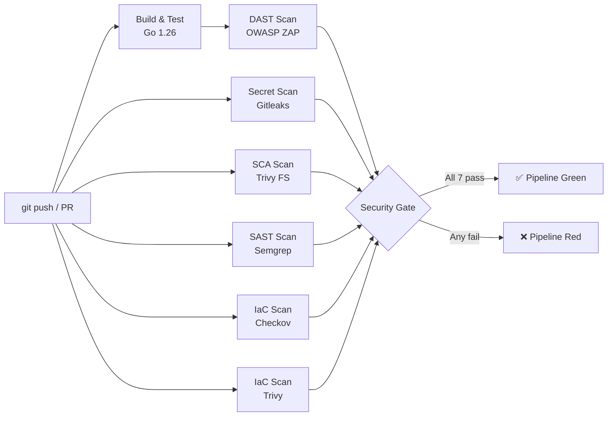

# Fase 2: Infrastructure as Code & Container Security (Hari 16–30)

> **Proyek:** SecureBank API — Kontainerisasi, hardening Docker, Terraform infra, dan DAST
> **Output Fase:** Image Docker yang hardened & signed, Terraform yang aman, pipeline terpadu dengan semua scan paralel.

---

## Hari 16: Dockerfile Multi-stage Build

### Tujuan
Membuat Docker image SecureBank API sekecil dan seaman mungkin menggunakan multi-stage build.

### Tutorial

**1. Buat `Dockerfile`:**
```dockerfile
# === Stage 1: Build ===
FROM golang:1.22-alpine AS builder

RUN apk add --no-cache git ca-certificates

WORKDIR /app

COPY go.mod go.sum ./
RUN go mod download

COPY . .

RUN CGO_ENABLED=0 GOOS=linux GOARCH=amd64 \
    go build -ldflags="-w -s" -o /securebank ./cmd/api

# === Stage 2: Runtime ===
FROM gcr.io/distroless/static-debian12:nonroot

COPY --from=builder /securebank /securebank
COPY --from=builder /etc/ssl/certs/ca-certificates.crt /etc/ssl/certs/

EXPOSE 8080

USER nonroot:nonroot

ENTRYPOINT ["/securebank"]
```

**2. Buat `.dockerignore`:**
```
.git
.github
docs
security
terraform
k8s
*.md
```

**3. Build dan test:**
```bash
docker build -t securebank:v1 .
docker run -p 8080:8080 securebank:v1
curl http://localhost:8080/health
```

**4. Cek ukuran image:**
```bash
docker images securebank:v1
# Target: < 15MB karena distroless + stripped binary
```

### Checklist
- [ ] Multi-stage build: golang:alpine → distroless
- [ ] Binary di-strip (`-ldflags="-w -s"`)
- [ ] Image < 15MB
- [ ] Aplikasi berjalan normal di container

---

## Hari 17: Container Image Scanning

### Tujuan
Memindai Docker image untuk CVE pada base image dan layer dependencies.

### Tutorial

**1. Scan image dengan Trivy:**
```bash
trivy image securebank:v1
trivy image --severity HIGH,CRITICAL securebank:v1
```

**2. Bandingkan dengan image non-distroless:**
```bash
# Build versi "naif" untuk perbandingan
docker build -t securebank:naive --target builder .
trivy image securebank:naive
# Jauh lebih banyak CVE karena alpine + go toolchain
```

**3. Export report:**
```bash
trivy image securebank:v1 --format json --output security/trivy-image-report.json
```

### Checklist
- [ ] Scan image distroless: minimal/zero CVE
- [ ] Scan image builder: banyak CVE (bukti pentingnya multi-stage)
- [ ] Report JSON disimpan di `security/`
- [ ] Memahami perbedaan OS-level vs app-level CVE

---

## Hari 18: Dockerfile Hardening

### Tujuan
Menerapkan best practice keamanan container: non-root, read-only, no new privileges.

### Tutorial

**1. Verifikasi Dockerfile sudah memiliki:**
```dockerfile
USER nonroot:nonroot  # ✅ sudah dari hari 16
```

**2. Tambahkan health check di Dockerfile:**
```dockerfile
HEALTHCHECK --interval=30s --timeout=3s --retries=3 \
  CMD ["/securebank", "-health-check"] || exit 1
```

**3. Buat `docker-compose.yml` dengan security options:**
```yaml
version: '3.8'

services:
  securebank:
    build: .
    image: securebank:v1
    ports:
      - "8080:8080"
    environment:
      - DB_HOST=postgres
      - DB_PASSWORD=${DB_PASSWORD}
    security_opt:
      - no-new-privileges:true
    read_only: true
    tmpfs:
      - /tmp:noexec,nosuid,size=10m
    deploy:
      resources:
        limits:
          cpus: '0.5'
          memory: 128M
    healthcheck:
      test: ["CMD", "wget", "--spider", "-q", "http://localhost:8080/health"]
      interval: 30s
      timeout: 5s
      retries: 3

  postgres:
    image: postgres:16-alpine
    environment:
      POSTGRES_DB: securebank
      POSTGRES_PASSWORD: ${DB_PASSWORD}
    volumes:
      - pgdata:/var/lib/postgresql/data
    security_opt:
      - no-new-privileges:true

volumes:
  pgdata:
```

**4. Test:**
```bash
DB_PASSWORD=localdev123 docker compose up -d
curl http://localhost:8080/health
```

### Checklist
- [ ] Container berjalan sebagai non-root
- [ ] `read_only: true` + tmpfs untuk /tmp
- [ ] `no-new-privileges` aktif
- [ ] Resource limits (CPU + Memory) ditentukan
- [ ] Health check berjalan

---

## Hari 19: Image Signing dengan Cosign

### Tujuan
Menandatangani image Docker untuk menjamin integritas dan provenance.

### Tutorial

**1. Install Cosign:**
```bash
brew install cosign
```

**2. Generate key pair:**
```bash
cosign generate-key-pair
# Menghasilkan cosign.key (private) dan cosign.pub (public)
```

**3. Push image ke registry (contoh: GitHub Container Registry):**
```bash
docker tag securebank:v1 ghcr.io/<username>/securebank:v1
docker push ghcr.io/<username>/securebank:v1
```

**4. Sign image:**
```bash
cosign sign --key cosign.key ghcr.io/<username>/securebank:v1
```

**5. Verifikasi signature:**
```bash
cosign verify --key cosign.pub ghcr.io/<username>/securebank:v1
```

**6. Tambahkan `cosign.key` ke `.gitignore`:**
```
cosign.key
```

### Checklist
- [ ] Key pair di-generate
- [ ] Image di-push ke registry
- [ ] Image ditandatangani dengan Cosign
- [ ] Signature bisa diverifikasi
- [ ] Private key TIDAK di-commit (ada di `.gitignore`)

---

## Hari 20: Terraform Setup + IaC Scanning (Checkov)

### Tujuan
Menulis Terraform dasar (VPC + S3) dan memindai misconfiguration dengan Checkov.

### Tutorial

**1. Buat `terraform/main.tf`:**
```hcl
terraform {
  required_version = ">= 1.7"
  required_providers {
    aws = {
      source  = "hashicorp/aws"
      version = "~> 5.0"
    }
  }
}

provider "aws" {
  region = var.aws_region
}

# VPC — intentionally misconfigured for training
resource "aws_vpc" "main" {
  cidr_block           = "10.0.0.0/16"
  enable_dns_hostnames = true

  tags = {
    Name        = "securebank-vpc"
    Environment = var.environment
  }
}

# S3 Bucket — intentionally insecure for training
resource "aws_s3_bucket" "logs" {
  bucket = "securebank-logs-${var.environment}"
  # Missing: versioning, encryption, public access block
}

# Security Group — intentionally too open
resource "aws_security_group" "api" {
  name   = "securebank-api-sg"
  vpc_id = aws_vpc.main.id

  ingress {
    from_port   = 0
    to_port     = 65535
    protocol    = "tcp"
    cidr_blocks = ["0.0.0.0/0"]  # INTENTIONAL: open to world
  }

  egress {
    from_port   = 0
    to_port     = 0
    protocol    = "-1"
    cidr_blocks = ["0.0.0.0/0"]
  }
}
```

**2. Buat `terraform/variables.tf`:**
```hcl
variable "aws_region" {
  default = "ap-southeast-1"
}

variable "environment" {
  default = "dev"
}
```

**3. Install dan jalankan Checkov:**
```bash
pip3 install checkov
checkov -d terraform/
```

**4. Perhatikan temuan: S3 tanpa enkripsi, SG terbuka, dll.**

### Checklist
- [ ] Terraform files dibuat di `terraform/`
- [ ] Checkov menemukan ≥ 5 misconfiguration
- [ ] Output dipahami (check ID, resource, guideline)
- [ ] Belum diperbaiki (itu tugas hari 23)

---

## Hari 21: IaC Scanning dengan tfsec & Trivy

### Tujuan
Membandingkan multiple IaC scanner untuk coverage yang lebih baik.

### Tutorial

**1. Install tfsec:**
```bash
brew install tfsec
```

**2. Scan Terraform:**
```bash
tfsec terraform/
```

**3. Scan juga dengan Trivy (mode IaC):**
```bash
trivy config terraform/
```

**4. Bandingkan:**

Buat `security/iac-scan-comparison.md`:
```markdown
| Finding | Checkov | tfsec | Trivy |
|---------|---------|-------|-------|
| S3 no encryption | ✅ | ✅ | ✅ |
| SG open to world | ✅ | ✅ | ✅ |
| S3 no versioning | ✅ | ✅ | ❌ |
| ... | | | |
```

### Checklist
- [ ] tfsec dan Trivy config scan berjalan
- [ ] Perbandingan 3 tools didokumentasikan
- [ ] Memahami kelebihan masing-masing scanner

---

## Hari 22: IaC Scan di Pipeline

### Tujuan
Pipeline khusus infra yang menggagalkan build jika Terraform tidak aman.

### Tutorial

**Buat `.github/workflows/infra.yml`:**
```yaml
name: Infrastructure Security

on:
  push:
    paths:
      - 'terraform/**'
  pull_request:
    paths:
      - 'terraform/**'

jobs:
  iac-scan:
    runs-on: ubuntu-latest
    steps:
      - uses: actions/checkout@v4

      - name: Run Checkov
        uses: bridgecrewio/checkov-action@v12
        with:
          directory: terraform/
          framework: terraform
          soft_fail: false  # gagalkan pipeline
          output_format: sarif
          output_file_path: checkov.sarif

      - name: Run tfsec
        uses: aquasecurity/tfsec-action@v1.0.0
        with:
          working_directory: terraform/
          soft_fail: false

      - name: Upload SARIF
        if: always()
        uses: github/codeql-action/upload-sarif@v3
        with:
          sarif_file: checkov.sarif
```

### Checklist
- [ ] Pipeline trigger hanya pada perubahan `terraform/`
- [ ] Checkov + tfsec berjalan
- [ ] Pipeline gagal karena SG terbuka 0.0.0.0/0
- [ ] SARIF ter-upload ke GitHub Security

---

## Hari 23: IaC Remediation

### Tujuan
Memperbaiki semua misconfiguration Terraform hingga pipeline hijau.

### Tutorial

**Update `terraform/main.tf`:**
```hcl
# S3 Bucket — FIXED
resource "aws_s3_bucket" "logs" {
  bucket = "securebank-logs-${var.environment}"
}

resource "aws_s3_bucket_versioning" "logs" {
  bucket = aws_s3_bucket.logs.id
  versioning_configuration {
    status = "Enabled"
  }
}

resource "aws_s3_bucket_server_side_encryption_configuration" "logs" {
  bucket = aws_s3_bucket.logs.id
  rule {
    apply_server_side_encryption_by_default {
      sse_algorithm = "aws:kms"
    }
  }
}

resource "aws_s3_bucket_public_access_block" "logs" {
  bucket                  = aws_s3_bucket.logs.id
  block_public_acls       = true
  block_public_policy     = true
  ignore_public_acls      = true
  restrict_public_buckets = true
}

# Security Group — FIXED
resource "aws_security_group" "api" {
  name   = "securebank-api-sg"
  vpc_id = aws_vpc.main.id

  ingress {
    description = "HTTPS from VPC"
    from_port   = 443
    to_port     = 443
    protocol    = "tcp"
    cidr_blocks = [aws_vpc.main.cidr_block]
  }

  ingress {
    description = "API port from VPC"
    from_port   = 8080
    to_port     = 8080
    protocol    = "tcp"
    cidr_blocks = [aws_vpc.main.cidr_block]
  }

  egress {
    from_port   = 443
    to_port     = 443
    protocol    = "tcp"
    cidr_blocks = ["0.0.0.0/0"]
    description = "HTTPS outbound only"
  }
}
```

**Verifikasi:**
```bash
checkov -d terraform/
tfsec terraform/
# Semua check PASSED
```

### Checklist
- [ ] S3: versioning + encryption + public access block
- [ ] SG: hanya port 443 & 8080, hanya dari VPC CIDR
- [ ] Checkov + tfsec: 0 FAILED
- [ ] Pipeline infra hijau

---

## Hari 24: DAST Setup — OWASP ZAP

### Tujuan
Menyerang aplikasi SecureBank API yang sedang berjalan untuk menemukan kerentanan runtime.

### Tutorial

**1. Jalankan SecureBank lokal:**
```bash
docker compose up -d
```

**2. Jalankan ZAP Baseline Scan:**
```bash
docker run --rm --network host \
  ghcr.io/zaproxy/zaproxy:stable \
  zap-baseline.py \
  -t http://localhost:8080 \
  -r zap-report.html \
  -J zap-report.json
```

**3. Buka `zap-report.html` di browser.**

**4. Catat temuan umum:**
- Missing `Content-Security-Policy` header
- Missing `X-Content-Type-Options` header
- Missing `Strict-Transport-Security` header

### Checklist
- [ ] ZAP berjalan dan memindai aplikasi
- [ ] Report HTML dan JSON dihasilkan
- [ ] Temuan security headers dicatat
- [ ] Report disimpan di `security/`

---

## Hari 25: DAST Pipeline Integration

### Tujuan
ZAP berjalan otomatis di pipeline setelah deploy ke staging.

### Tutorial

**Tambahkan job ke `.github/workflows/ci.yml`:**
```yaml
  dast-scan:
    needs: [build-and-test]
    runs-on: ubuntu-latest
    services:
      securebank:
        image: securebank:v1
        ports:
          - 8080:8080
    steps:
      - name: Wait for app
        run: |
          for i in $(seq 1 30); do
            curl -sf http://localhost:8080/health && break
            sleep 2
          done

      - name: ZAP Baseline Scan
        uses: zaproxy/action-baseline@v0.12.0
        with:
          target: 'http://localhost:8080'
          allow_issue_writing: false

      - name: Upload ZAP Report
        if: always()
        uses: actions/upload-artifact@v4
        with:
          name: zap-report
          path: report_html.html
```

### Checklist
- [ ] ZAP berjalan setelah app di-deploy di CI
- [ ] Report ter-upload sebagai artifact
- [ ] Temuan tercatat

---

## Hari 26: DAST Remediation — Security Headers

### Tujuan
Menambahkan security headers di middleware Golang untuk memperbaiki temuan ZAP.

### Tutorial

**Buat `internal/middleware/security.go`:**
```go
package middleware

import "net/http"

func SecurityHeaders(next http.Handler) http.Handler {
    return http.HandlerFunc(func(w http.ResponseWriter, r *http.Request) {
        w.Header().Set("Content-Security-Policy", "default-src 'self'")
        w.Header().Set("X-Content-Type-Options", "nosniff")
        w.Header().Set("X-Frame-Options", "DENY")
        w.Header().Set("Strict-Transport-Security", "max-age=63072000; includeSubDomains")
        w.Header().Set("X-XSS-Protection", "0")
        w.Header().Set("Referrer-Policy", "strict-origin-when-cross-origin")
        w.Header().Set("Permissions-Policy", "camera=(), microphone=(), geolocation=()")
        next.ServeHTTP(w, r)
    })
}
```

**Update `cmd/api/main.go` untuk menggunakan middleware:**
```go
mux := http.NewServeMux()
mux.HandleFunc("/health", healthCheck)
mux.HandleFunc("/balance", getBalance)
mux.HandleFunc("/transfer", transfer)

handler := middleware.SecurityHeaders(mux)
log.Fatal(http.ListenAndServe(":8080", handler))
```

**Verifikasi:**
```bash
curl -I http://localhost:8080/health
# Harus muncul semua security headers
```

### Checklist
- [ ] Middleware security headers dibuat
- [ ] Semua 7 headers ditambahkan
- [ ] ZAP re-scan: temuan header berkurang
- [ ] Unit test untuk middleware

---

## Hari 27: AI-Assisted IaC Automation

### Tujuan
Menggunakan AI untuk memperbaiki Terraform yang kompleks sesuai standar industri.

### Tutorial

**1. Ambil Terraform block yang masih belum optimal.**

**2. Prompt ke AI:**
```
Kamu adalah AWS Solutions Architect. Perbaiki Terraform berikut agar memenuhi:
- CIS AWS Foundations Benchmark v2.0
- AWS Well-Architected Framework (Security Pillar)
- Prinsip least privilege

[paste terraform code]
```

**3. Terapkan perbaikan, verifikasi dengan Checkov.**

### Checklist
- [ ] AI memberikan perbaikan berbasis standar industri
- [ ] Perbaikan diterapkan dan diverifikasi
- [ ] Checkov pass 100%

---

## Hari 28: Compliance as Code — Chef InSpec

### Tujuan
Menulis test keamanan infrastruktur yang bisa dijalankan berulang.

### Tutorial

**1. Install InSpec:**
```bash
brew install --cask chef/chef/inspec
```

**2. Buat profile `security/inspec-profiles/securebank/`:**
```bash
inspec init profile security/inspec-profiles/securebank
```

**3. Tulis test di `controls/network.rb`:**
```ruby
control 'ssh-port-closed' do
  impact 1.0
  title 'SSH port should be closed'
  desc 'Port 22 should not be open to public internet'

  describe port(22) do
    it { should_not be_listening }
  end
end

control 'api-port-listening' do
  impact 0.7
  title 'API port should be listening'

  describe port(8080) do
    it { should be_listening }
  end
end

control 'no-root-process' do
  impact 1.0
  title 'Application should not run as root'

  describe processes('securebank') do
    its('users') { should_not include 'root' }
  end
end
```

**4. Jalankan:**
```bash
inspec exec security/inspec-profiles/securebank/
```

### Checklist
- [ ] InSpec profile dibuat
- [ ] 3 controls: SSH closed, API listening, non-root
- [ ] Test berjalan dan hasilnya dipahami

---

## Hari 29: Pipeline Consolidation — Full Security Pipeline

### Tujuan
Menggabungkan SEMUA scan ke satu pipeline yang berjalan paralel.

### Tutorial

**Update `.github/workflows/security-scan.yml`:**
```yaml
name: Full Security Scan

on:
  push:
    branches: [main, develop]
  pull_request:
    branches: [main]

jobs:
  secret-scan:
    runs-on: ubuntu-latest
    steps:
      - uses: actions/checkout@v4
        with: { fetch-depth: 0 }
      - uses: gitleaks/gitleaks-action@v2
        env: { GITHUB_TOKEN: "${{ secrets.GITHUB_TOKEN }}" }

  sca-scan:
    runs-on: ubuntu-latest
    steps:
      - uses: actions/checkout@v4
      - uses: aquasecurity/trivy-action@master
        with:
          scan-type: fs
          scan-ref: '.'
          exit-code: '1'
          severity: CRITICAL

  sast-scan:
    runs-on: ubuntu-latest
    steps:
      - uses: actions/checkout@v4
      - uses: semgrep/semgrep-action@v1
        with:
          config: "p/golang p/owasp-top-ten"

  image-scan:
    runs-on: ubuntu-latest
    steps:
      - uses: actions/checkout@v4
      - run: docker build -t securebank:ci .
      - uses: aquasecurity/trivy-action@master
        with:
          image-ref: securebank:ci
          exit-code: '1'
          severity: CRITICAL

  iac-scan:
    runs-on: ubuntu-latest
    steps:
      - uses: actions/checkout@v4
      - uses: bridgecrewio/checkov-action@v12
        with:
          directory: terraform/
          soft_fail: false

  # Gate — semua scan harus lulus
  security-gate:
    needs: [secret-scan, sca-scan, sast-scan, image-scan, iac-scan]
    runs-on: ubuntu-latest
    steps:
      - run: echo "✅ All security scans passed"
```

### Checklist
- [ ] 5 scan jobs berjalan paralel
- [ ] `security-gate` job sebagai final check
- [ ] Total waktu < 3 menit (paralel)
- [ ] Pipeline hijau = kode & infra aman

---

## Hari 30: Dokumentasi Fase 2

### Tujuan
Merangkum Container Security, IaC Security, DAST, dan Pipeline Consolidation.

---

# Fase 2: Dokumentasi Retrospektif

> **Tanggal:** 2026-07-06  
> **Durasi:** Hari 16–30 (15 hari)  
> **Status:** ✅ Selesai  

---

## 1. Arsitektur Pipeline Final



**8 jobs total, 7 scanner + 1 security gate:**

| # | Job | Tool | Purpose | Quality Gate |
|---|-----|------|---------|-------------|
| 1 | Build & Test | Go 1.26 | Compile, unit test with race detection, coverage | `go test` exit code 0 |
| 2 | Secret Scan | Gitleaks 8.30.1 | Deteksi credential/API key di git history | Any leak = block |
| 3 | SCA Scan | Trivy FS | Scan dependensi Go untuk CVE CRITICAL/HIGH | Any CRITICAL/HIGH = block |
| 4 | SAST Scan | Semgrep | Analisis statis kode Go untuk insecure pattern | Any ERROR = block |
| 5 | DAST Scan | OWASP ZAP | Dynamic scan running API | `continue-on-error: true` (10049 false positive) |
| 6 | IaC Scan (Checkov) | Checkov | Scan Terraform misconfiguration | Any failed check = block |
| 7 | IaC Scan (Trivy) | Trivy Config | Scan Terraform CVE/misconfig MEDIUM+ | Any MEDIUM+ = block |
| 8 | Security Gate | — | Final quality gate, depends on all 7 above | All 7 must pass |

---

## 2. Tools yang Digunakan

| Tool | Fungsi | Config File | Versi | Sumber |
|------|--------|-------------|-------|--------|
| Docker | Container runtime | `Dockerfile`, `docker-compose.yml` | 24+ | Docker Desktop |
| Distroless | Minimal base image | `Dockerfile` (final stage) | static-debian12 | gcr.io/distroless |
| Cosign | Image signing | `cosign.pub`, `cosign.key` | v3.1.1 | GitHub releases |
| Terraform | IaC provisioning | `terraform/*.tf` (8 files) | latest | terraform.io |
| Checkov | IaC scanning (Terraform) | inline skip comments | v12 | bridgecrewio/checkov-action |
| Trivy | IaC + SCA scanning | `.trivyignore.yaml` (removed) | latest | aquasecurity/trivy-action |
| OWASP ZAP | DAST scanning | zap.yaml | v0.13.0 (action) | zaproxy/action-baseline |
| Chef InSpec | Compliance as Code | `inspec.yml` | v5.22.3 | brew cask |
| Semgrep | SAST (carry-over Fase 1) | `.semgrep.yml` | latest | semgrep-action |
| Gitleaks | Secret scan (carry-over) | `.gitleaks.toml` | 8.30.1 | binary install |
| GitHub Actions | CI/CD | `.github/workflows/ci.yml` | N/A | github.com |

---

## 3. Quality Gates

### 3.1 Container Image Hardening

| Layer | Implementation | Day |
|-------|---------------|-----|
| Multi-stage build | golang:1.26-alpine → distroless | 16 |
| Non-root user | `USER nonroot:nonroot` (UID 65532) | 18 |
| COPY --chown | `COPY --chown=nonroot:nonroot` | 18 |
| No shell | Distroless static (no `sh`, no `bash`) | 16 |
| Read-only filesystem | `readonly: true` in compose | 18 |
| tmpfs /tmp | `tmpfs: /tmp` in compose | 18 |
| no-new-privileges | `security_opt: no-new-privileges:true` | 18 |
| Cap drop ALL | `cap_drop: ALL` | 18 |
| Resource limits | CPU 0.5, Memory 128M, PIDs 64 | 18 |

### 3.2 Image Signing (Cosign)

- Key pair generated: `cosign.key` (private, gitignored), `cosign.pub` (public, committed)
- Image pushed to GHCR (GitHub Container Registry)
- Sign: `cosign sign --key cosign.key <image>`
- Verify: `cosign verify --key cosign.pub <image>` — 3/3 success

### 3.3 IaC Scanning (Checkov + Trivy)

- **Checkov**: 102 checks passed, 0 failed (Day 23 remediation)
- **Trivy IaC**: 0 findings at CRITICAL/HIGH/MEDIUM (Day 23)
- Severity threshold: CRITICAL/HIGH/MEDIUM (LOW excluded with justification)
- Trivy does NOT support inline ignore for Terraform — only `.trivyignore` files

### 3.4 DAST (OWASP ZAP)

- Baseline passive scan: 0 FAIL, 1 WARN (rule 10049), 66 PASS
- **Rule 10049**: Cache-Control false positive for API — `continue-on-error: true`
- Remediation: 8 security headers via `SecurityHeadersHandler` wrapper (Day 26)
- CI approach: Go binary build (faster than Docker build in CI, ~5s vs ~30s)

### 3.5 Compliance (InSpec) — Local Only

- Profile: `security/inspec-profiles/securebank/`
- 3 controls: `ssh-port-closed`, `api-port-listening`, `no-root-process`
- Result: 3/3 PASS
- Stays local — not added to CI pipeline (user decision)

---

## 4. Security Improvements Applied

| Day | Finding | Fix | Status |
|-----|---------|-----|--------|
| 16 | Naive Dockerfile (350MB alpine) | Multi-stage: golang:1.26-alpine → distroless static | ✅ 7.97MB (44x smaller) |
| 17 | CVE in base image | Scan with `trivy image`, 0 CVE in distroless | ✅ Verified |
| 18 | Container has root, no resource limits | 8-layer hardening in docker-compose | ✅ Hardened |
| 19 | No image signing | Cosign v3.1.1 sign + verify | ✅ Signed |
| 20 | S3 bucket unencrypted, SG open 0.0.0.0/0 | Terraform: S3 SSE-KMS, SG restricted to 10.0.0.0/16 | ✅ Fixed |
| 21 | IaC scanner comparison | Checkov + Trivy IaC — both 0 findings after remediation | ✅ Verified |
| 22 | IaC scan not in pipeline | Added to `ci.yml` | ✅ Integrated |
| 23 | S3 no versioning, KMS key too permissive | SSE-KMS, S3 versioning, KMS deletion_window 7 days | ✅ Fixed |
| 24 | No DAST | ZAP Baseline Scan via Docker | ✅ Setup |
| 25 | DAST not in pipeline | `zaproxy/action-baseline@v0.13.0` with Go binary | ✅ Integrated |
| 26 | Missing security headers, ZAP 10049 WARN | SecurityHeadersHandler: 8 headers, Cache-Control fixed | ✅ Fixed |
| 27 | AI review: no variable validation, no outputs | 6 validated vars, 12 outputs, IAM Condition, S3 lifecycle | ✅ Fixed |
| 28 | No compliance checks | InSpec profile: 3/3 controls PASS | ✅ Setup |
| 29 | 2 separate workflow files | Consolidated to 1 `ci.yml` (8 jobs + security gate) | ✅ Consolidated |

---

## 5. Metrics

| Metrik | Nilai |
|--------|-------|
| Docker image size (naive alpine) | ~350MB |
| Docker image size (distroless) | 7.97MB |
| Size reduction | 44x smaller |
| CVE in base image (distroless) | 0 |
| Cosign signing | Verified 3/3 |
| Terraform files | 10 (main, s3, network, compute, iam, kms, notifications, variables, outputs, DESTROY.md) |
| Checkov checks passed | 102 / 102 (100%) |
| Checkov checks failed | 0 |
| Trivy IaC findings (MEDIUM+) | 0 |
| ZAP scan: FAIL | 0 |
| ZAP scan: WARN | 1 (rule 10049, false positive) |
| ZAP scan: PASS | 66 |
| InSpec controls | 3/3 PASS |
| Security headers implemented | 8 (X-Content-Type-Options, X-Frame-Options, Cache-Control, CSP, X-XSS-Protection, Referrer-Policy, Permissions-Policy, Cross-Origin-Resource-Policy) |
| Pipeline jobs (final) | 8 (7 scanner + 1 security gate) |
| Pipeline workflow files | 1 (was 2, consolidated) |
| Unit tests | 25 (all PASS) |
| Go version | 1.26.0 |

---

## 6. Lessons Learned

### 6.1 Distroless = Smallest Attack Surface

Distroless static image has no shell, no package manager, no utilities — hanya binary + CA certs. Image turun dari ~350MB (alpine) ke 7.97MB (44x smaller). Tidak ada shell artinya attacker yang dapat RCE tidak bisa `ls`, `cat`, atau pivot. **Trade-off**: tidak bisa `HEALTHCHECK` di Dockerfile (no shell) — akan pakai Kubernetes liveness probe di Fase 3.

### 6.2 Gitleaks `--no-gitignore` Flag Tidak Pernah Ada

Selama Day 14 sampai Day 22, pipeline RED karena `--no-gitignore` yang dicantumkan di retrospective Fase 1 ternyata tidak pernah ada sebagai flag Gitleaks. Solusi: hapus flag, gunakan `[allowlist]` di `.gitleaks.toml`. **Asumsi validasi**: selalu cek `gitleaks --help` sebelum menulis dokumentasi.

### 6.3 Cosign Non-Interactive Mode

Cosign prompt password untuk dekrypt private key. Di CI (non-interactive), pakai `COSIGN_PASSWORD=""` (empty string, key tanpa password) atau `COSIGN_PASSWORD` dari GitHub Secrets. Untuk local dev, `COSIGN_PASSWORD=""` cukup.

### 6.4 Checkov vs Trivy IaC — Complementary, Bukan Competing

- **Checkov**: 102 checks spesifik Terraform (policy-as-code), SARIF output ke GitHub Security tab, inline skip comments `#checkov:skip=CKV_xxx: reason`
- **Trivy IaC**: support multiple formats (Terraform + K8s + Dockerfile + CloudFormation), threshold-based gate (CRITICAL/HIGH/MEDIUM)
- **Keduanya dipakai**: Checkov untuk policy detail, Trivy untuk multi-format + severity gate

### 6.5 ZAP Rule 10049 = False Positive untuk API

Rule 10049 ("Content Cacheability") menandai response yang "storable dan cacheable" sebagai WARN. Untuk API dengan `Cache-Control: no-cache, no-store, must-revalidate, private`, ini justru **correct behavior** — API response tidak boleh di-cache. ZAP tetap WARN bahkan setelah header ditambahkan (dual personality). Solusi: `continue-on-error: true` di CI step.

### 6.6 Go Binary Approach untuk DAST di CI

Dibanding build Docker image (~30s), compile Go binary langsung di CI runner (~5s) dengan ZAP scan hasil yang identik. **Approach**: `go build -o securebank ./cmd/api` → start binary → ZAP scan `localhost:8080` → upload report. Lebih cepat, lebih simple, hasil sama.

### 6.7 `http.NewServeMux()` + Handler Wrapper untuk Middleware

`http.HandleFunc` (global mux) hanya applying middleware ke registered routes — 404 response tidak dapat security headers. Fix: gunakan `http.NewServeMux()` + wrap seluruh mux dengan `SecurityHeadersHandler(mux)`. Ini memastikan **semua** response (termasuk 404) dapat security headers.

### 6.8 0 Scanner Findings ≠ Production-Ready

AI review di Day 27 menemukan 6 improvements yang TIDAK ditemukan scanner: variable validation, IAM `aws:SourceAccount` Condition, S3 lifecycle policy, missing outputs, parameterization, prevent_destroy. **Scanner menemukan pattern, bukan design flaw.**

### 6.9 InSpec 7.x Gem Tidak Ship CLI

`gem install inspec` (InSpec 7.x) hanya install library Ruby, bukan CLI executable. Untuk CLI, butuh Chef Workstation installer via `brew install --cask chef/chef/inspec` (pkg installer butuh sudo). InSpec juga butuh `--chef-license accept` di first run.

---

## 7. Recommendations for Fase 3

| # | Rekomendasi | Prioritas | Target |
|---|-------------|-----------|--------|
| 1 | Deploy distroless image ke K8s (k3d) | 🔴 Critical | Hari 31 |
| 2 | Kubernetes liveness/readiness probe (no Dockerfile HEALTHCHECK) | 🔴 Critical | Hari 31 |
| 3 | SecurityContext hardening (readOnlyRootFilesystem, runAsNonRoot, allowPrivilegeEscalation: false) | 🟠 High | Hari 33 |
| 4 | OPA Gatekeeper policy enforcement | 🟠 High | Hari 34-36 |
| 5 | Network Policies (default deny all) | 🟠 High | Hari 37 |
| 6 | RBAC auditing (least privilege SA) | 🟡 Medium | Hari 38 |
| 7 | Falco runtime monitoring | 🟡 Medium | Hari 39-41 |
| 8 | Rate limiter middleware (carry-over dari Fase 1) | 🟠 High | Fase 3 |

---

## 8. Final File Structure (Fase 2)

```
securebank-api/
├── cmd/api/
│   ├── main.go                      # ServeMux + SecurityHeadersHandler wrapper
│   └── main_test.go                 # 15 handler + validation + auth + 404 tests
├── internal/middleware/
│   ├── auth.go                      # JWT Bearer middleware
│   └── security.go                  # SecurityHeaders + SecurityHeadersHandler (8 headers)
├── pkg/crypto/
│   ├── hash.go                      # bcrypt
│   └── jwtutil.go                   # JWT generate/parse
├── configs/
│   └── config.go                    # Config struct (env vars)
├── Dockerfile                       # Multi-stage: golang:1.26-alpine → distroless
├── docker-compose.yml               # 8-layer security hardening
├── cosign.pub                       # Public key (committed)
├── cosign.key                       # Private key (gitignored)
├── terraform/
│   ├── main.tf                      # Provider + backend config
│   ├── network.tf                   # VPC + subnet + SG
│   ├── s3.tf                        # S3 bucket with SSE-KMS + versioning + lifecycle
│   ├── compute.tf                   # EC2 instance
│   ├── iam.tf                       # IAM roles + policies (least privilege)
│   ├── kms.tf                       # KMS key with rotation + deletion window 7 days
│   ├── notifications.tf             # SNS + SQS
│   ├── variables.tf                 # 6 validated variables
│   ├── outputs.tf                   # 12 outputs
│   └── DESTROY.md                   # Teardown instructions
├── security/
│   ├── inspec-profiles/securebank/
│   │   ├── inspec.yml               # Profile metadata
│   │   └── controls/
│   │       ├── network.rb           # ssh-port-closed + api-port-listening
│   │       └── process.rb           # no-root-process
│   ├── zap-report.html              # ZAP scan report
│   ├── zap-report.json
│   ├── zap.yaml                     # ZAP config
│   ├── checkov-report.json
│   ├── trivy-iac-report.json
│   ├── trivy-fs-report.json
│   ├── trivy-image-report.json
│   ├── trivy-naive-image-report.json
│   ├── semgrep-*.json
│   └── threat-model/
│       └── architecture.md          # STRIDE + DREAD
├── go.mod                           # Go 1.26.0
├── go.sum
└── .gitignore

Root repo files:
├── .github/workflows/ci.yml         # Unified pipeline: 8 jobs + security gate
├── .gitleaks.toml                    # Gitleaks allowlist
├── .semgrep.yml                      # Custom Semgrep rule: no-md5-usage
├── blogpost.md                       # Blog post drafts (gitignored)
├── docs/
│   ├── fase-1-appsec.md             # Fase 1 tutorial + retrospective
│   └── fase-2-infra-container.md    # Fase 2 tutorial + retrospective (this file)
├── progress/
│   ├── README.md
│   ├── tracker.md
│   ├── daily/hari-01.md through hari-30.md
│   └── retrospektif/
│       ├── fase-1-retrospektif.md
│       └── fase-2-retrospektif.md
├── sylabus.md
└── README.md
```

---

## 9. Pipeline Execution History

| Day | Event | Pipeline Status |
|-----|-------|-----------------|
| 16 | Dockerfile multi-stage added | ✅ Green |
| 18 | docker-compose.yml hardening | ✅ Green |
| 19 | Cosign signing | ✅ Green |
| 22 | IaC scan added to infra.yml | ❌ Red (Checkov findings) |
| 23 | IaC remediation | ✅ Green (Checkov 102/0) |
| 24 | ZAP scan setup (local) | ✅ Verified |
| 25 | DAST scan added to ci.yml | ❌ Red (ZAP WARN 10049) |
| 26 | DAST remediation (security headers) | ✅ Green (continue-on-error) |
| 27 | AI-assisted IaC fix | ✅ Green (Checkov 102/0, Trivy 0) |
| 28 | InSpec compliance (local only) | ✅ 3/3 PASS (no CI impact) |
| 29 | Pipeline consolidation (infra.yml deleted) | ✅ Green (8/8 jobs) |

---

*Retrospektif ini ditulis pada Hari 30 sebagai penutup Fase 2.*

---

> ✅ **Selesai Fase 2** — Lanjut ke [Fase 3: Kubernetes & Runtime Security](fase-3-k8s-runtime.md)
