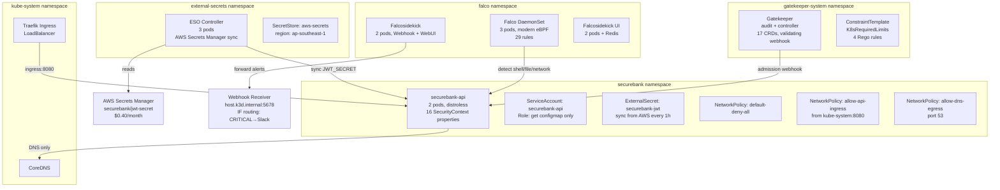

# Fase 3: Kubernetes & Runtime Security (Hari 31–45)

> **Proyek:** SecureBank API — Deploy ke K8s, hardening cluster, policy enforcement, runtime monitoring
> **Output Fase:** Cluster K8s yang hardened dengan OPA Gatekeeper, Network Policies, Falco monitoring, dan alerting.

---

## Hari 31: K8s Cluster Setup & Deploy

### Tujuan
Membuat cluster k3d lokal dan deploy SecureBank API.

### Tutorial

**1. Install k3d:**
```bash
brew install k3d
```

**2. Buat cluster:**
```bash
k3d cluster create securebank \
  --port "8080:80@loadbalancer" \
  --agents 2
```

**3. Buat `k8s/deployment.yaml`:**
```yaml
apiVersion: apps/v1
kind: Deployment
metadata:
  name: securebank-api
  namespace: securebank
  labels:
    app: securebank-api
spec:
  replicas: 2
  selector:
    matchLabels:
      app: securebank-api
  template:
    metadata:
      labels:
        app: securebank-api
    spec:
      containers:
        - name: api
          image: securebank:v1
          ports:
            - containerPort: 8080
          # Intentionally missing: securityContext, resources
          # Will be fixed on Day 33
```

**4. Buat `k8s/service.yaml`:**
```yaml
apiVersion: v1
kind: Service
metadata:
  name: securebank-api
  namespace: securebank
spec:
  selector:
    app: securebank-api
  ports:
    - port: 80
      targetPort: 8080
  type: ClusterIP
```

**5. Deploy:**
```bash
kubectl create namespace securebank
k3d image import securebank:v1 -c securebank
kubectl apply -f k8s/deployment.yaml
kubectl apply -f k8s/service.yaml
kubectl get pods -n securebank
```

**6. Port-forward untuk test:**
```bash
kubectl port-forward svc/securebank-api 8080:80 -n securebank &
curl http://localhost:8080/health
```

### Checklist
- [ ] k3d cluster running dengan 2 agents
- [ ] SecureBank API deployed (2 replicas)
- [ ] Service bisa diakses via port-forward
- [ ] `/health` endpoint merespons

---

## Hari 32: K8s Misconfiguration Scanning

### Tujuan
Memindai manifest Kubernetes untuk menemukan konfigurasi berisiko.

### Tutorial

**1. Install Kubesec:**
```bash
brew install kubesec
# atau gunakan online API
```

**2. Scan deployment:**
```bash
# Kubesec (lokal atau API)
kubesec scan k8s/deployment.yaml

# Checkov untuk K8s
checkov -f k8s/deployment.yaml --framework kubernetes

# Trivy config
trivy config k8s/
```

**3. Temuan yang diharapkan:**
- Container running as root
- No resource limits/requests
- No readOnlyRootFilesystem
- No securityContext defined
- allowPrivilegeEscalation not set to false

**4. Dokumentasikan temuan:**
```bash
checkov -f k8s/deployment.yaml --framework kubernetes \
  --output json > security/k8s-scan-report.json
```

### Checklist
- [ ] Kubesec + Checkov + Trivy scan berjalan
- [ ] ≥ 5 misconfiguration ditemukan
- [ ] Report JSON disimpan
- [ ] Temuan dipahami (apa risikonya)

---

## Hari 33: SecurityContext Hardening

### Tujuan
Memperbaiki deployment.yaml dengan security best practices.

### Tutorial

**Update `k8s/deployment.yaml`:**
```yaml
apiVersion: apps/v1
kind: Deployment
metadata:
  name: securebank-api
  namespace: securebank
  labels:
    app: securebank-api
spec:
  replicas: 2
  selector:
    matchLabels:
      app: securebank-api
  template:
    metadata:
      labels:
        app: securebank-api
    spec:
      automountServiceAccountToken: false
      securityContext:
        runAsNonRoot: true
        runAsUser: 65534
        runAsGroup: 65534
        fsGroup: 65534
        seccompProfile:
          type: RuntimeDefault
      containers:
        - name: api
          image: securebank:v1
          ports:
            - containerPort: 8080
              protocol: TCP
          securityContext:
            allowPrivilegeEscalation: false
            readOnlyRootFilesystem: true
            capabilities:
              drop: ["ALL"]
          resources:
            requests:
              cpu: 50m
              memory: 64Mi
            limits:
              cpu: 200m
              memory: 128Mi
          livenessProbe:
            httpGet:
              path: /health
              port: 8080
            initialDelaySeconds: 5
            periodSeconds: 10
          readinessProbe:
            httpGet:
              path: /health
              port: 8080
            initialDelaySeconds: 3
            periodSeconds: 5
```

**Re-deploy dan re-scan:**
```bash
kubectl apply -f k8s/deployment.yaml
checkov -f k8s/deployment.yaml --framework kubernetes
# Semua check PASSED
```

### Checklist
- [ ] `readOnlyRootFilesystem: true`
- [ ] `allowPrivilegeEscalation: false`
- [ ] `capabilities.drop: ["ALL"]`
- [ ] `runAsNonRoot: true`
- [ ] Resource limits/requests defined
- [ ] Liveness + readiness probes
- [ ] Checkov: 0 FAILED
- [ ] Pod tetap berjalan normal

---

## Hari 34: OPA Gatekeeper Setup

### Tujuan
Menginstall OPA Gatekeeper sebagai Admission Controller di cluster.

### Tutorial

**1. Add Helm repo dan install:**
```bash
helm repo add gatekeeper https://open-policy-agent.github.io/gatekeeper/charts
helm repo update

helm install gatekeeper gatekeeper/gatekeeper \
  --namespace gatekeeper-system \
  --create-namespace \
  --set replicas=1
```

**2. Verifikasi:**
```bash
kubectl get pods -n gatekeeper-system
kubectl get crd | grep gatekeeper
# Harus ada: constrainttemplates.templates.gatekeeper.sh
```

### Checklist
- [ ] Gatekeeper pods running
- [ ] CRDs terinstall
- [ ] Webhook aktif (validating admission webhook)

---

## Hari 35: Rego Policy — Wajib Resource Limits

### Tujuan
Menulis policy Rego yang menolak Pod tanpa resource limits.

### Tutorial

**1. Buat `k8s/gatekeeper/constraint-templates/require-limits.yaml`:**
```yaml
apiVersion: templates.gatekeeper.sh/v1
kind: ConstraintTemplate
metadata:
  name: k8srequiredlimits
spec:
  crd:
    spec:
      names:
        kind: K8sRequiredLimits
  targets:
    - target: admission.k8s.gatekeeper.sh
      rego: |
        package k8srequiredlimits

        violation[{"msg": msg}] {
          container := input.review.object.spec.containers[_]
          not container.resources.limits.cpu
          msg := sprintf("Container '%v' has no CPU limit", [container.name])
        }

        violation[{"msg": msg}] {
          container := input.review.object.spec.containers[_]
          not container.resources.limits.memory
          msg := sprintf("Container '%v' has no memory limit", [container.name])
        }
```

**2. Buat `k8s/gatekeeper/constraints/require-limits.yaml`:**
```yaml
apiVersion: constraints.gatekeeper.sh/v1beta1
kind: K8sRequiredLimits
metadata:
  name: require-resource-limits
spec:
  match:
    kinds:
      - apiGroups: [""]
        kinds: ["Pod"]
      - apiGroups: ["apps"]
        kinds: ["Deployment"]
    namespaces:
      - securebank
```

**3. Apply:**
```bash
kubectl apply -f k8s/gatekeeper/constraint-templates/require-limits.yaml
kubectl apply -f k8s/gatekeeper/constraints/require-limits.yaml
```

### Checklist
- [ ] ConstraintTemplate applied
- [ ] Constraint applied di namespace `securebank`
- [ ] Policy siap diuji (hari 36)

---

## Hari 36: OPA Policy Testing

### Tujuan
Memvalidasi bahwa Gatekeeper menolak Pod tanpa resource limits.

### Tutorial

**1. Buat pod tanpa limits:**
```yaml
# k8s/test-no-limits.yaml
apiVersion: v1
kind: Pod
metadata:
  name: test-no-limits
  namespace: securebank
spec:
  containers:
    - name: nginx
      image: nginx:latest
      # NO resources defined
```

**2. Coba apply:**
```bash
kubectl apply -f k8s/test-no-limits.yaml
# ERROR: admission webhook "validation.gatekeeper.sh" denied the request:
# Container 'nginx' has no CPU limit
```

**3. Verifikasi constraints:**
```bash
kubectl get constraints
kubectl describe k8srequiredlimits require-resource-limits
```

**4. Hapus test file, commit policy:**
```bash
rm k8s/test-no-limits.yaml
git add k8s/gatekeeper/
git commit -m "security: add OPA Gatekeeper policy requiring resource limits"
```

### Checklist
- [ ] Pod tanpa limits DITOLAK oleh Gatekeeper
- [ ] Error message jelas dan informatif
- [ ] Pod dengan limits (deployment.yaml) tetap diterima
- [ ] Policy di-commit ke repo

---

## Hari 37: Network Policies

### Tujuan
Menerapkan Default Deny dan whitelist traffic yang diizinkan.

### Tutorial

**1. Buat `k8s/network-policy.yaml`:**
```yaml
# Default Deny All Ingress
apiVersion: networking.k8s.io/v1
kind: NetworkPolicy
metadata:
  name: default-deny-all
  namespace: securebank
spec:
  podSelector: {}
  policyTypes:
    - Ingress
    - Egress

---
# Allow Ingress to API only from ingress controller
apiVersion: networking.k8s.io/v1
kind: NetworkPolicy
metadata:
  name: allow-api-ingress
  namespace: securebank
spec:
  podSelector:
    matchLabels:
      app: securebank-api
  policyTypes:
    - Ingress
  ingress:
    - from:
        - namespaceSelector:
            matchLabels:
              kubernetes.io/metadata.name: kube-system
      ports:
        - protocol: TCP
          port: 8080

---
# Allow DNS egress (semua pod butuh DNS)
apiVersion: networking.k8s.io/v1
kind: NetworkPolicy
metadata:
  name: allow-dns-egress
  namespace: securebank
spec:
  podSelector: {}
  policyTypes:
    - Egress
  egress:
    - to:
        - namespaceSelector: {}
      ports:
        - protocol: UDP
          port: 53
        - protocol: TCP
          port: 53
```

**2. Apply:**
```bash
kubectl apply -f k8s/network-policy.yaml
```

**3. Test — dari pod lain, coba akses API:**
```bash
# Ini harus GAGAL (denied by network policy)
kubectl run test-curl --rm -it --image=curlimages/curl \
  -n default -- curl http://securebank-api.securebank.svc:80
```

### Checklist
- [ ] Default Deny All diterapkan
- [ ] API hanya bisa diakses dari ingress controller
- [ ] DNS egress diizinkan
- [ ] Cross-namespace access diblokir

---

## Hari 38: RBAC Auditing

### Tujuan
Mengaudit dan memperketat izin akses di cluster.

### Tutorial

**1. Install rakkess:**
```bash
kubectl krew install access-matrix
```

**2. Audit:**
```bash
# Siapa yang bisa create pods?
kubectl who-can create pods -n securebank

# Access matrix untuk service account default
kubectl access-matrix -n securebank --sa default
```

**3. Buat `k8s/rbac.yaml` — service account khusus:**
```yaml
apiVersion: v1
kind: ServiceAccount
metadata:
  name: securebank-api
  namespace: securebank
  automountServiceAccountToken: false

---
apiVersion: rbac.authorization.k8s.io/v1
kind: Role
metadata:
  name: securebank-api-role
  namespace: securebank
rules:
  - apiGroups: [""]
    resources: ["configmaps"]
    verbs: ["get"]
    resourceNames: ["securebank-config"]
  # Minimal permissions — hanya baca configmap spesifik

---
apiVersion: rbac.authorization.k8s.io/v1
kind: RoleBinding
metadata:
  name: securebank-api-binding
  namespace: securebank
subjects:
  - kind: ServiceAccount
    name: securebank-api
    namespace: securebank
roleRef:
  kind: Role
  name: securebank-api-role
  apiGroup: rbac.authorization.k8s.io
```

**4. Update deployment untuk menggunakan SA baru:**
```yaml
spec:
  template:
    spec:
      serviceAccountName: securebank-api
```

### Checklist
- [ ] RBAC diaudit dengan rakkess/who-can
- [ ] Service account khusus dibuat (least privilege)
- [ ] Deployment menggunakan SA baru
- [ ] Default SA tidak digunakan

---

## Hari 39: Runtime Security — Falco Setup

### Tujuan
Menginstall Falco untuk monitoring ancaman runtime.

### Tutorial

**1. Install Falco via Helm:**
```bash
helm repo add falcosecurity https://falcosecurity.github.io/charts
helm repo update

helm install falco falcosecurity/falco \
  --namespace falco \
  --create-namespace \
  --set falcosidekick.enabled=true \
  --set falcosidekick.webui.enabled=true
```

**2. Verifikasi:**
```bash
kubectl get pods -n falco
kubectl logs -l app.kubernetes.io/name=falco -n falco --tail=20
```

**3. Lihat default rules yang aktif:**
```bash
kubectl exec -n falco $(kubectl get pod -n falco -l app.kubernetes.io/name=falco -o name | head -1) \
  -- cat /etc/falco/falco_rules.yaml | head -50
```

### Checklist
- [ ] Falco pods running
- [ ] Falcosidekick enabled
- [ ] Default rules aktif dan menghasilkan log
- [ ] Memahami format output Falco

---

## Hari 40: Falco Custom Rules

### Tujuan
Membuat aturan Falco kustom yang relevan untuk SecureBank.

### Tutorial

**1. Buat `security/falco-rules/securebank-rules.yaml`:**
```yaml
- rule: Shell spawned in SecureBank container
  desc: Detect shell execution in securebank containers
  condition: >
    spawned_process and
    container and
    container.image.repository contains "securebank" and
    proc.name in (bash, sh, ash, zsh)
  output: >
    ALERT: Shell opened in SecureBank container
    (user=%user.name container=%container.name
    image=%container.image.repository command=%proc.cmdline
    pod=%k8s.pod.name namespace=%k8s.ns.name)
  priority: WARNING
  tags: [securebank, shell]

- rule: Sensitive file read in SecureBank
  desc: Detect access to sensitive paths
  condition: >
    open_read and
    container and
    container.image.repository contains "securebank" and
    (fd.name startswith /etc/shadow or
     fd.name startswith /etc/passwd or
     fd.name startswith /proc/self/environ)
  output: >
    ALERT: Sensitive file read in SecureBank
    (file=%fd.name user=%user.name container=%container.name
    pod=%k8s.pod.name)
  priority: CRITICAL
  tags: [securebank, filesystem]

- rule: Network tool in SecureBank container
  desc: Detect network reconnaissance tools
  condition: >
    spawned_process and
    container and
    container.image.repository contains "securebank" and
    proc.name in (nc, ncat, nmap, wget, curl, dig)
  output: >
    ALERT: Network tool detected in SecureBank
    (tool=%proc.name user=%user.name pod=%k8s.pod.name)
  priority: NOTICE
  tags: [securebank, network]
```

**2. Apply via Helm upgrade:**
```bash
helm upgrade falco falcosecurity/falco \
  --namespace falco \
  --set-file customRules."securebank-rules\.yaml"=security/falco-rules/securebank-rules.yaml
```

### Checklist
- [ ] 3 custom rules dibuat
- [ ] Rules di-load oleh Falco
- [ ] Rules relevan untuk konteks perbankan

---

## Hari 41: Falco Attack Simulation

### Tujuan
Mensimulasikan serangan dan memastikan Falco mendeteksinya.

### Tutorial

**1. Exec ke container (simulasi attacker):**
```bash
# Ini akan trigger "Shell spawned" rule
kubectl exec -it $(kubectl get pod -n securebank -l app=securebank-api -o name | head -1) \
  -n securebank -- /bin/sh
```

*Catatan: jika menggunakan distroless, shell tidak tersedia — ini membuktikan keamanan distroless! Deploy pod test dengan alpine jika perlu:*

```bash
kubectl run attacker-sim --rm -it \
  -n securebank --image=alpine -- /bin/sh
# Di dalam container:
cat /etc/passwd
wget http://securebank-api/health
```

**2. Cek Falco logs:**
```bash
kubectl logs -l app.kubernetes.io/name=falco -n falco --tail=50 | grep "ALERT"
```

**3. Verifikasi deteksi:**
- [ ] Shell spawned → WARNING
- [ ] Sensitive file read → CRITICAL (jika custom rule aktif)
- [ ] Network tool → NOTICE

**4. Cleanup:**
```bash
kubectl delete pod attacker-sim -n securebank --ignore-not-found
```

### Checklist
- [ ] Simulasi serangan berhasil dilakukan
- [ ] Falco mendeteksi semua aktivitas
- [ ] Log level sesuai (WARNING/CRITICAL)
- [ ] Distroless membuktikan shell tidak tersedia di production container

---

## Hari 42: Automated Alerting — n8n Webhook

### Tujuan
Menghubungkan alert Falco ke sistem automasi n8n.

### Tutorial

**1. Deploy n8n lokal:**
```bash
docker run -d --name n8n \
  -p 5678:5678 \
  -v n8n_data:/home/node/.n8n \
  n8nio/n8n
```

**2. Buka `http://localhost:5678`, buat workflow baru.**

**3. Tambahkan node:**
- **Webhook** trigger (method: POST, path: `/falco-alert`)
- **IF** node: cek `body.priority` == `Critical`
- **True branch**: (akan dihubungkan ke Slack di hari 48)
- **False branch**: log ke file

**4. Konfigurasi Falcosidekick untuk kirim ke n8n:**
```bash
helm upgrade falco falcosecurity/falco \
  --namespace falco \
  --set falcosidekick.config.webhook.address="http://host.k3d.internal:5678/webhook/falco-alert"
```

**5. Test: trigger ulang simulasi hari 41 → cek n8n mendapat data.**

### Checklist
- [ ] n8n berjalan dan workflow dibuat
- [ ] Webhook endpoint siap menerima JSON
- [ ] Falcosidekick mengirim alert ke n8n
- [ ] Data alert masuk ke n8n workflow

---

## Hari 43: K8s Secret Management — External Secrets

### Tujuan
Menarik secrets dari AWS Secrets Manager ke K8s secara aman.

### Tutorial

**1. Install External Secrets Operator:**
```bash
helm repo add external-secrets https://charts.external-secrets.io
helm install external-secrets external-secrets/external-secrets \
  --namespace external-secrets \
  --create-namespace
```

**2. Buat SecretStore (contoh AWS):**
```yaml
# k8s/external-secrets/secret-store.yaml
apiVersion: external-secrets.io/v1beta1
kind: SecretStore
metadata:
  name: aws-secrets
  namespace: securebank
spec:
  provider:
    aws:
      service: SecretsManager
      region: ap-southeast-1
      auth:
        secretRef:
          accessKeyIDSecretRef:
            name: aws-credentials
            key: access-key-id
          secretAccessKeySecretRef:
            name: aws-credentials
            key: secret-access-key
```

**3. Buat ExternalSecret:**
```yaml
# k8s/external-secrets/db-secret.yaml
apiVersion: external-secrets.io/v1beta1
kind: ExternalSecret
metadata:
  name: securebank-db
  namespace: securebank
spec:
  refreshInterval: 1h
  secretStoreRef:
    name: aws-secrets
    kind: SecretStore
  target:
    name: securebank-db-credentials
    creationPolicy: Owner
  data:
    - secretKey: DB_PASSWORD
      remoteRef:
        key: securebank/db-password
```

**4. Update deployment untuk mount secret:**
```yaml
env:
  - name: DB_PASSWORD
    valueFrom:
      secretKeyRef:
        name: securebank-db-credentials
        key: DB_PASSWORD
```

### Checklist
- [ ] External Secrets Operator terinstall
- [ ] SecretStore mengarah ke AWS Secrets Manager
- [ ] ExternalSecret membuat K8s Secret secara otomatis
- [ ] Deployment membaca secret dari environment variable

---

## Hari 44: AI Threat Modeling pada K8s

### Tujuan
Menggunakan AI untuk menganalisis attack surface cluster.

### Tutorial

**1. Kumpulkan data cluster:**
```bash
kubectl get networkpolicies -A -o yaml > security/threat-model/netpol.yaml
kubectl get roles,rolebindings -A -o yaml > security/threat-model/rbac.yaml
kubectl get pods -A -o yaml > security/threat-model/pods.yaml
```

**2. Prompt ke AI:**
```
Kamu adalah Kubernetes Security Specialist. Analisis konfigurasi cluster berikut:

[paste netpol, rbac, pods yaml]

Identifikasi:
1. Top 3 jalur serangan (attack paths) — misalnya: pod escape, lateral movement, privilege escalation
2. Untuk setiap jalur: prasyarat, langkah eksploitasi, dan mitigasi
3. Skor risiko berdasarkan CVSS framework
4. Rekomendasi hardening tambahan
```

**3. Dokumentasikan di `security/threat-model/k8s-threat-analysis.md`.**

### Checklist
- [ ] Data cluster dikumpulkan
- [ ] AI menganalisis 3 attack paths
- [ ] Mitigasi didokumentasikan
- [ ] Threat model K8s tersimpan

---

## Hari 45: Dokumentasi Fase 3

### Tujuan
Merangkum semua K8s security yang diterapkan.

### Tutorial
Tulis `docs/fase-3-k8s-runtime.md`:
- Arsitektur cluster (diagram)
- SecurityContext checklist
- OPA Gatekeeper policies dan efeknya
- Network Policies topology
- Falco rules dan alert flow
- RBAC audit findings
- Metrics: jumlah policy violations blocked

### Checklist
- [ ] Dokumen lengkap
- [ ] Diagram arsitektur disertakan
- [ ] Commit: `docs: fase 3 kubernetes and runtime security`

---

> ✅ **Selesai Fase 3** — Lanjut ke [Fase 4: Vulnerability Management & Red Teaming](fase-4-vuln-redteam.md)

---

# Retrospektif Fase 3 — Kubernetes & Runtime Security

> **Periode:** Hari 31–45 (15 hari)  
> **Tanggal Retrospektif:** 2026-07-22  
> **Ditulis oleh:** Muhammad Indragiri dengan AI assist (glm-5.2)

---

## 4. Security Improvements Applied

| Day | Finding | Fix | Status |
|-----|---------|-----|--------|
| 31 | No K8s cluster, no deployment | k3d cluster (1 server + 2 agents), 4 manifests (namespace, secret, deployment, service) | ✅ 2 pods Running |
| 32 | K8s misconfigurations (3 scanners) | Kubesec 14 advise, Checkov 20 failed, Trivy 16 findings — baseline documented | ✅ Baseline set |
| 33 | SecurityContext missing (26 lines) | 16 security properties added (65 lines): non-root, read-only FS, cap drop, seccomp, probes, resources | ✅ Kubesec 0→11, Checkov 20→0, Trivy 16→0 |
| 34 | No admission control | OPA Gatekeeper Helm install, 17 CRDs, validating webhook active | ✅ 2 pods Running |
| 35 | No resource limit policy | ConstraintTemplate + Constraint (4 Rego rules, enforcementAction: deny) | ✅ Policy applied |
| 36 | Policy untested | 3 test scenarios: no resources=DENIED (4 violations), full=ACCEPTED, partial=ACCEPTED (K8s auto-fill) | ✅ Policy verified |
| 37 | No NetworkPolicy (CKV2_K8S_6) | 3 policies: default-deny-all, allow-api-ingress (kube-system), allow-dns-egress | ✅ CKV2_K8S_6 PASS, k3s flannel enforces |
| 38 | default SA, no RBAC (Kubesec advise) | Dedicated SA + Role (get configmap only, resourceNames) + RoleBinding | ✅ Kubesec 11→12, least privilege verified |
| 39 | No runtime monitoring | Falco 0.44.1 Helm install, modern eBPF driver, 25 default rules, Falcosidekick + WebUI | ✅ 8 pods Running |
| 40 | No app-specific rules | 4 custom rules: shell (WARNING), sensitive file (CRITICAL), network tool (NOTICE), K8s API (WARNING) | ✅ 29 rules, schema validation OK |
| 41 | Detection untested | Attack simulation: distroless blocks shell, 6 Falco alerts fired (3/4 rules), NetworkPolicy blocks egress | ✅ Defense in depth proven |
| 42 | Alerts only to WebUI dashboard | Python webhook receiver + IF routing (CRITICAL→Slack, others→log), Falcosidekick webhook output | ✅ 3 alerts received end-to-end |
| 43 | Secret in git (base64 K8s Secret) | External Secrets Operator → AWS Secrets Manager sync, Secret Reference Pattern, aws-credentials gitignored | ✅ SecretSynced 20s, GitHub Push Protection blocked leak |
| 44 | No cluster threat model | AI (glm-5.2) threat analysis: 3 attack paths, CVSS scoring, MITRE ATT&CK mapping, 9 recommendations | ✅ k8s-threat-analysis.md (~450 lines) |

---

## 5. Metrics

| Metrik | Before (Day 31) | After (Day 44) |
|--------|-----------------|----------------|
| Kubesec score | 0 | 12 |
| Kubesec advise | 14 | 2 (AppArmor, SeccompAny) |
| Checkov K8s passed | 85 | 102 |
| Checkov K8s failed | 20 | 0 |
| Checkov K8s skipped | 4 (CLI) | 2 (CKV_K8S_15, CKV_K8S_43) |
| Trivy K8s findings | 16 (3H/3M/10L) | 0 |
| SecurityContext properties | 0 | 16 |
| NetworkPolicies | 0 | 3 (default-deny + allow-ingress + allow-dns) |
| RBAC resources | 0 | 3 (SA + Role + RoleBinding) |
| Gatekeeper CRDs | 0 | 17 |
| Gatekeeper violations blocked | — | 4 (Day 36 test) |
| Falco rules | 0 | 29 (25 default + 4 custom) |
| Falco alerts fired | 0 | 6 (attack simulation Day 41) |
| Falcosidekick outputs | 0 | 2 (WebUI + Webhook) |
| ESO sync time | — | 20 seconds |
| Namespaces | 4 (kube-system, default, dll) | 8 (+securebank, gatekeeper-system, falco, external-secrets) |
| Pods | 2 (SecureBank only) | 15+ across 5 namespaces |
| AI threat paths analyzed | 0 | 3 (CVSS 9.8, 7.5, 8.6) |
| Distroless shell exec blocked | — | 4 attempts failed (Day 41) |
| Secrets in git | 1 (base64 JWT_SECRET) | 0 (ESO-managed, gitignored) |
| AWS Secrets Manager | 0 | 1 ($0.40/month) |

---

## 6. Lessons Learned

### 6.1 k3s Flannel SUPPORT NetworkPolicy

Day 37 surprise: k3d default CNI (flannel) ternyata **enforce** NetworkPolicy. Flannel standalone tidak support enforcement, tapi k3s menyertakan NetworkPolicy controller. Test membuktikan: cross-namespace access BLOCKED, same-namespace BLOCKED. NetworkPolicy benar-benar di-enforce, bukan hanya object ada.

### 6.2 k3d Tracepoint Limitation is PARTIAL, Not Total

Day 39-40 document "k3d tracepoint limitation = rules can't trigger". **Day 41 correction: limitation is PARTIAL.** `execve` dan `openat` tracepoints work, hanya `connect` yang missing. 3/4 custom rules fired. eBPF probe butuh warm-up time (~25 min) setelah helm upgrade — Day 40 test tidak fire karena probe belum ready.

### 6.3 Distroless = Prevention, Falco = Detection

Day 41 proven: distroless blocks shell exec (4 attempts fail), Falco detects if attacker somehow gets shell. NetworkPolicy blocks egress (wget refused). All 5 defense layers work together. **Distroless is the real security win — prevention > detection.**

### 6.4 Default Deny + Whitelist = Best NetworkPolicy Pattern

Mulai dengan "block everything", kemudian allow hanya yang dibutuhkan. Kalau lupa deny sesuatu, tidak ada celah — default-nya sudah deny. kubelet probes bypass NetworkPolicy (via node, bukan CNI). Port-forward bypass NetworkPolicy (via API Server tunnel).

### 6.5 `default` SA = No Accountability

Semua Pod tanpa `serviceAccountName` pakai `default` SA. Dedicated SA = explicit, auditable. `resourceNames` in Role = true least privilege (restrict ke specific configmap, bukan semua). `automountServiceAccountToken: false` + dedicated SA = defense in depth.

### 6.6 rakkess Repo 404 → access-matrix krew Plugin

rakkess GitHub repo sudah deleted/archived. Maintainer memindahkan ke krew sebagai `access-matrix` plugin. Selalu cek status repo sebelum install. `kubectl auth can-i` = most precise for verifying exact permissions.

### 6.7 Secret Reference Pattern

Git repo cuma berisi referensi (nama-nama), bukan nilai secret. SecretStore references `aws-credentials` (nama), ExternalSecret references `securebank/jwt-secret` (AWS name). Kalau repo leak, attacker tahu nama tapi tidak tahu nilai. ESO = decouple secrets from git.

### 6.8 GitHub Push Protection Actually Works

Checkov report JSON mengandung AWS keys (scanned dari gitignored file di disk). Push Protection **blocked the push**. Fix: remove report dari commit, gitignore. Ini bukan theoretical — GitHub actually prevented secret leak. Real security layer in action.

### 6.9 Falcosidekick Multi-Output: WebUI + Webhook

WebUI untuk visual inspection (human review), Webhook untuk automation (programmatic routing). IF node logic: CRITICAL → Slack (Day 48), others → log. Priority-based routing = alert fatigue prevention.

### 6.10 AI sebagai Threat Modeler

glm-5.2 (model yang powered session ini) menganalisis cluster config dan identify 3 attack paths dengan CVSS + MITRE ATT&CK mapping. AI actually read the YAML dan produce analysis. Tie ke `docs/ai-assistant-brainstorm.md` (Day 39) — skill `threat-modeler` adalah salah satu 7 skills yang dirancang.

### 6.11 DevSecOps = Problem Solving, Bukan Dogmatic Tool Following

n8n Docker image pull timed out (2x, 5 min each) → pivot ke Python webhook receiver. Same learning objectives, no Docker pull, committed to repo. Tutorial adalah guide, bukan gospel. Pragmatic solution > stuck on tooling.

### 6.12 Defense in Depth: 6 Layers, No Single Point of Failure

| Layer | Tool | Function |
|-------|------|----------|
| Admission Control | Gatekeeper | Block non-compliant pods |
| Image Security | Distroless + Cosign | No shell, signed images |
| Network Isolation | NetworkPolicy | Default deny + whitelist |
| Access Control | RBAC | Least privilege SA |
| Runtime Detection | Falco + Falcosidekick | Syscall monitoring + alert |
| Secret Management | ESO | AWS sync, no secrets in git |

Setiap attack path dari Day 44 punya 4+ mitigations. Tidak ada single point of failure.

---

## 7. Cluster Architecture



---

## 8. File Structure (Fase 3 additions)

```
securebank-api/
├── k8s/
│   ├── namespace.yaml              # Namespace: securebank
│   ├── secret.yaml                 # Original K8s Secret (placeholder, unused)
│   ├── deployment.yaml             # 65 lines, hardened (16 SecurityContext)
│   ├── service.yaml                # ClusterIP, port 80→8080
│   ├── network-policy.yaml         # 3 NetworkPolicies
│   ├── rbac.yaml                   # SA + Role + RoleBinding
│   ├── gatekeeper/
│   │   ├── constraint-templates/
│   │   │   └── require-limits.yaml # Rego policy (4 rules)
│   │   └── constraints/
│   │       └── require-limits.yaml # Constraint (deny)
│   └── external-secrets/
│       ├── secret-store.yaml       # SecretStore → AWS
│       ├── jwt-secret.yaml         # ExternalSecret → K8s Secret
│       └── aws-credentials.yaml    # AWS keys (GITIGNORED)
├── security/
│   ├── kubesec-report.json         # Day 32 baseline
│   ├── checkov-k8s-report.json     # Day 32 baseline
│   ├── trivy-k8s-report.json       # Day 32 baseline
│   ├── k8s-scan-comparison.md      # 3 scanner comparison
│   ├── kubesec-post-fix-report.json# Day 33 (score 11)
│   ├── checkov-k8s-post-fix-report.json
│   ├── trivy-k8s-post-fix-report.json
│   ├── kubesec-rbac-report.json    # Day 38 (score 12)
│   ├── checkov-k8s-rbac-report.json
│   ├── checkov-k8s-netpol-report.json # Day 37
│   ├── falco-rules/
│   │   └── securebank-rules.yaml   # 4 custom rules
│   ├── falco-values.yaml           # Helm values (driver + sidekick + webhook)
│   ├── n8n-webhook/
│   │   ├── webhook_receiver.py     # Python webhook + IF logic
│   │   └── logs/falco-alerts.log   # Alert audit log
│   └── threat-model/
│       ├── architecture.md         # Fase 1 (STRIDE + DREAD)
│       ├── k8s-threat-analysis.md  # Fase 3 (3 attack paths, CVSS)
│       ├── netpol.yaml             # Cluster data dump
│       ├── rbac.yaml               # Cluster data dump
│       ├── pods.yaml               # Cluster data dump
│       └── deploy-svc.yaml         # Cluster data dump
└── docs/
    └── ai-assistant-brainstorm.md  # Hermes Agent brainstorm (Day 39)
```

---

## 9. Defense in Depth Summary

| Layer | Tool | Day | What It Prevents/Detects |
|-------|------|-----|--------------------------|
| **Admission Control** | OPA Gatekeeper | 34-36 | Pods without resource limits denied before deploy |
| **Image Security** | Distroless + Cosign | 18-19 | No shell for attacker, signed images for integrity |
| **Network Isolation** | NetworkPolicy | 37 | Default deny all, only kube-system ingress, DNS egress |
| **Access Control** | RBAC | 38 | Dedicated SA, get configmap only, no token automount |
| **Runtime Detection** | Falco + Falcosidekick | 39-42 | 29 rules, syscall monitoring, webhook alert routing |
| **Secret Management** | External Secrets Operator | 43 | AWS sync, no secrets in git, auto-rotation 1h |

**Day 41 Attack Simulation proven:** All 6 layers work together. Attacker → no shell (distroless) → if shell obtained → Falco detects → NetworkPolicy blocks egress → alert forwarded.

**Day 44 AI Threat Model validated:** 3 attack paths, each with 4+ mitigations. No single point of failure.

---

*Retrospektif ini ditulis pada Hari 45 sebagai penutup Fase 3.*

---

> ✅ **Selesai Fase 3** — Lanjut ke [Fase 4: Vulnerability Management & Red Teaming](fase-4-vuln-redteam.md)
