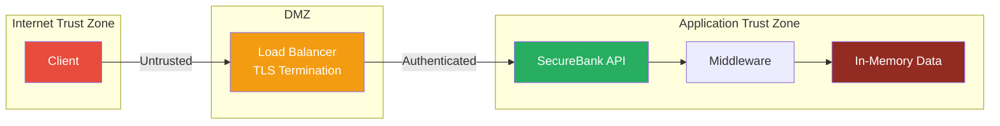
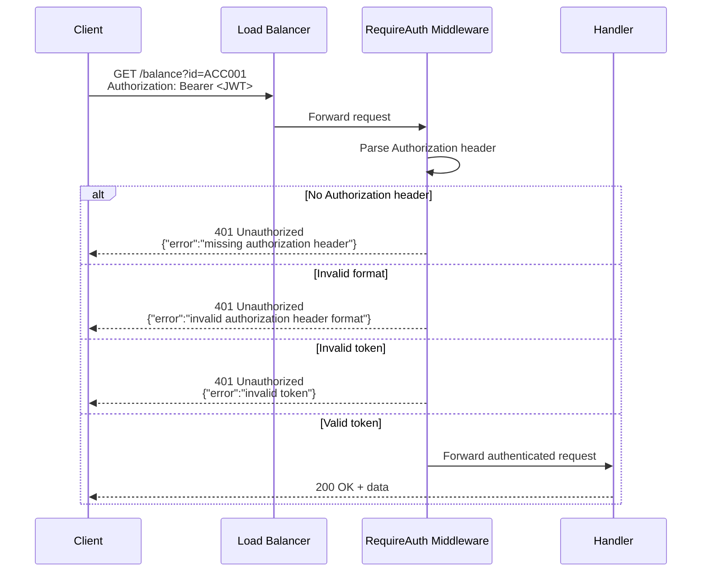
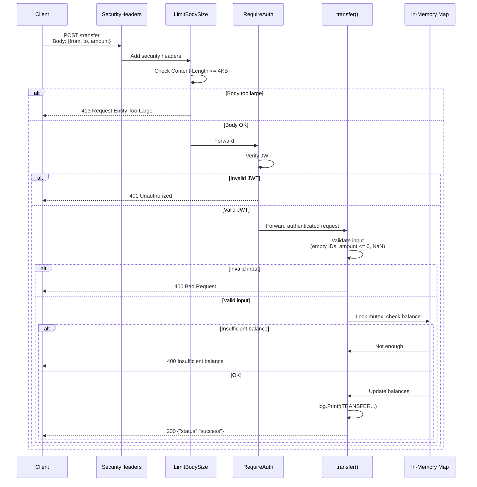

# SecureBank API — Threat Model

> **Tanggal:** 2026-06-15  
> **Versi:** 1.0  
> **Metodologi:** STRIDE + DREAD  
> **Scope:** SecureBank API (Fase 1 — post Day 11 security audit)

---

## 1. Arsitektur

### Diagram Komponen

```mermaid
graph TB
    Client[Client Browser / Mobile App]
    LB[Load Balancer / Reverse Proxy<br/>nginx / cloud LB<br/>TLS Termination]
    API[SecureBank API<br/>Go HTTP Server :8080]
    MW[Middleware Stack<br/>SecurityHeaders → LimitBodySize → RequireAuth]
    
    subgraph Public Endpoints
        Health[/health<br/>Public - No Auth]
    end
    
    subgraph Protected Endpoints
        Balance[/balance<br/>JWT Auth Required]
        Transfer[/transfer<br/>JWT Auth Required]
    end
    
    subgraph Middleware Layer
        SH[SecurityHeaders<br/>X-Content-Type-Options<br/>X-Frame-Options<br/>Cache-Control<br/>CSP<br/>X-XSS-Protection]
        LBS[LimitBodySize<br/>1KB /balance<br/>4KB /transfer]
        RA[RequireAuth<br/>JWT HMAC-SHA256<br/>Bearer Token]
    end
    
    subgraph Data Store
        InMem[In-Memory Map<br/>ACC001: Alice 10000<br/>ACC002: Bob 5000]
    end

    Client -->|HTTPS| LB
    LB -->|HTTP| API
    API --> MW
    MW --> Health
    MW --> Balance
    MW --> Transfer
    Balance --> InMem
    Transfer --> InMem

    style Client fill:#4a9eff,color:#fff
    style LB fill:#2d7dd2,color:#fff
    style API fill:#1a5276,color:#fff
    style MW fill:#117a65,color:#fff
    style InMem fill:#922B21,color:#fff
```

### Trust Boundaries



---

## 2. Data Flow

### Authentication Flow



### Transfer Flow



---

## 3. STRIDE Analysis

| # | Category | Threat | Target | Description | Mitigation | Status |
|---|----------|--------|--------|-------------|------------|--------|
| 1 | **S**poofing | JWT token forgery | `/balance`, `/transfer` | Attacker memalsukan JWT token untuk impersonate user lain | HMAC-SHA256 signing dengan JWT_SECRET dari env var | ✅ Implemented |
| 2 | **S**poofing | Default JWT secret fallback | Config | JWT_SECRET default `dev-secret-change-in-production` bisa di-brute-force | Harus wajib set JWT_SECRET di production, fail jika kosong | ⚠️ Warning — default fallback masih ada |
| 3 | **S**poofing | Missing auth on future endpoints | Semua endpoint baru | Developer lupa tambah auth middleware | Default-deny: semua endpoint butuh auth kecuali whitelist | ⚠️ Partial — middleware ada tapi belum enforced di router level |
| 4 | **T**ampering | Negative/zero amount transfer | `/transfer` | Attacker kirim `amount: -500` atau `amount: 0` | Input validation: reject amount <= 0, amount > 1B, NaN/Inf | ✅ Implemented |
| 5 | **T**ampering | JWT payload manipulation | Auth middleware | Attacker modify JWT claims (sub, exp) | HMAC signature verification — perubahan payload invalidates signature | ✅ Implemented |
| 6 | **T**ampering | Account ID manipulation | `/transfer`, `/balance` | User kirim `from: "ACC002"` padahal bukan pemilik — bisa transfer dari akun siapa saja | User-scoped authorization: JWT sub claim harus cocok dengan from account | ❌ Not Implemented |
| 7 | **T**ampering | Empty/whitespace account IDs | `/transfer` | `from: " "` lolos validasi | `strings.TrimSpace()` sebelum validasi kosong | ✅ Implemented |
| 8 | **R**epudiation | No persistent audit trail | `/transfer` | Transaksi hanya di-log ke stdout (`log.Printf`), tidak persist | Structured logging ke file/DB dengan timestamp, user ID, amount | ⚠️ Partial — console log only |
| 9 | **R**epudiation | No failed auth logging | Auth middleware | Failed login attempts tidak tercatat | Log setiap 401 response dengan IP dan timestamp | ❌ Not Implemented |
| 10 | **I**nfo Disclosure | Balance of any account | `/balance` | User dengan JWT valid bisa query saldo akun siapa saja (`?id=ACC002`) | User-scoped: JWT sub claim membatasi akses ke akun sendiri | ❌ Not Implemented |
| 11 | **I**nfo Disclosure | Error message leakage | Semua endpoints | Error messages ekspos detail internal | Generic JSON error responses tanpa stack trace | ✅ Implemented |
| 12 | **I**nfo Disclosure | No HTTPS/TLS in transit | Semua endpoints | Data kirim terang (plaintext) melalui HTTP | Reverse proxy (nginx/cloud LB) handle TLS termination di production | ⚠️ Accepted — dev environment |
| 13 | **I**nfo Disclosure | JWT_SECRET di environment variable | Config | JWT_SECRET bisa ter-expose melalui process environment, `/proc/environ` | Restrict file permissions, use secrets manager | ⚠️ Risk accepted — mitigasi di Fase 3 (K8s Secrets) |
| 14 | **D**enial of Service | Large request body | Semua endpoints | Attacker kirim body sangat besar | LimitBodySize middleware: 1KB (read), 4KB (write) | ✅ Implemented |
| 15 | **D**enial of Service | No rate limiting | Semua endpoints | Attacker flood API dengan ribuan request per detik | Rate limiter middleware (token bucket / sliding window) | ❌ Not Implemented |
| 16 | **D**enial of Service | No connection limit | HTTP server | Server menerima unlimited concurrent connections | `http.Server` MaxConnsPerHost, ConnReadTimeout, ConnWriteTimeout | ❌ Not Implemented |
| 17 | **E**levation of Privilege | Hardcoded accounts | In-memory map | ACC001/ACC002 hardcoded tanpa mekanisme user registration/embed | User registration + database + role-based access control | ❌ Not Implemented |
| 18 | **E**levation of Privilege | No RBAC (Role-Based Access Control) | Semua endpoints | Semua authenticated user punya akses yang sama | Role claim di JWT (admin/user) + middleware authorization | ❌ Not Implemented |

---

## 4. DREAD Risk Assessment

> **DREAD Scale:** Damage (0-10), Reproducibility (0-10), Exploitability (0-10), Affected Users (0-10), Discoverability (0-10)  
> **DREAD Score** = (D + R + E + A + D_discoverability) / 5  
> **Priority:** 🔴 Critical (8-10) · 🟠 High (6-7) · 🟡 Medium (4-5) · 🟢 Low (1-3)

| # | Threat | D | R | E | A | D_disc | Score | Priority |
|---|--------|---|---|---|---|--------|-------|----------|
| 15 | No rate limiting | 8 | 10 | 10 | 10 | 10 | **9.6** | 🔴 Critical |
| 10 | Balance of any account | 9 | 9 | 8 | 8 | 8 | **8.4** | 🔴 Critical |
| 6 | Account ID manipulation | 9 | 8 | 8 | 8 | 7 | **8.0** | 🔴 Critical |
| 17 | Hardcoded accounts | 7 | 9 | 8 | 7 | 8 | **7.8** | 🟠 High |
| 16 | No connection limit | 8 | 7 | 7 | 8 | 6 | **7.2** | 🟠 High |
| 18 | No RBAC | 8 | 6 | 6 | 8 | 5 | **6.6** | 🟠 High |
| 2 | Default JWT secret fallback | 10 | 4 | 5 | 7 | 5 | **6.2** | 🟠 High |
| 8 | No persistent audit trail | 5 | 8 | 5 | 7 | 5 | **6.0** | 🟠 High |
| 9 | No failed auth logging | 4 | 7 | 5 | 6 | 5 | **5.4** | 🟡 Medium |
| 12 | No HTTPS/TLS (dev) | 6 | 5 | 4 | 6 | 8 | **5.8** | 🟡 Medium |
| 3 | Missing auth on future endpoints | 7 | 4 | 4 | 5 | 4 | **4.8** | 🟡 Medium |
| 13 | JWT_SECRET in env var | 5 | 3 | 3 | 5 | 4 | **4.0** | 🟡 Medium |

### DREAD Summary

| Priority | Count | Threats |
|----------|-------|---------|
| 🔴 Critical | 3 | No rate limiting, Balance exposure, Account ID manipulation |
| 🟠 High | 4 | Hardcoded accounts, No connection limit, No RBAC, Default JWT secret |
| 🟡 Medium | 4 | No failed auth logging, No HTTPS, Missing auth on new endpoints, JWT_SECRET in env |
| 🟢 Low | 0 | — |
| ✅ Mitigated | 6 | JWT forgery, Input validation, JWT tampering, Security headers, Body size limit, Error messages |

---

## 5. Mitigation Roadmap

### Top 3 Prioritas

| # | Mitigasi | Threat # | DREAD Score | Fase Target |
|---|----------|----------|-------------|-------------|
| 1 | **Rate limiter middleware** (token bucket, 100 req/min/IP) | #15 | 9.6 | Fase 1 (Day 13+ / upcoming) |
| 2 | **User-scoped authorization** (JWT sub claim restrict akses per akun) | #10, #6 | 8.4, 8.0 | Fase 1-2 |
| 3 | **Persistent audit logging** (structured JSON log ke file) | #8, #9 | 6.0, 5.4 | Fase 1-2 |

### Mitigasi Lainnya (Fase Berikutnya)

| Mitigasi | Threat # | Fase Target |
|----------|----------|-------------|
| RBAC (admin/user roles di JWT) | #18 | Fase 2 |
| Connection limits (`http.Server` tuning) | #16 | Fase 2 |
| Database + user registration | #17 | Fase 2 |
| JWT_SECRET mandatory (fail jika kosong) | #2 | Fase 2 |
| HTTPS via reverse proxy | #12 | Fase 2 |
| Secrets management (K8s Secrets) | #13 | Fase 3 |

---

## 6. Attack Tree — Transfer Endpoint

```
OR: Steal money from another account
├── OR: Access another user's account
│   ├── AND: Forge JWT token
│   │   ├── Brute-force JWT_SECRET (DREAD: 6.2)
│   │   └── Use default dev secret (DREAD: 6.2)
│   ├── AND: Access balance endpoint
│   │   └── No user-scoped authorization (DREAD: 8.4) ← EASIEST
│   └── AND: Transfer from another account
│       └── Specify arbitrary from account ID (DREAD: 8.0) ← EASIEST
├── OR: Manipulate transfer amount
│   ├── Negative amount → REJECTED by validation
│   ├── Zero amount → REJECTED by validation
│   └── Overflow/NaN → REJECTED by validation
└── OR: Deny the transfer
    └── No persistent audit log (DREAD: 6.0)
```

**Easiest attack path:** Valid JWT → query `/balance?id=ACC002` → see anyone's balance → transfer from arbitrary account. This is why **user-scoped authorization** (mitigation #2) is critical.

---

*Threat model ini akan di-update seiring bertambahnya fitur dan lapisan keamanan di fase berikutnya.*