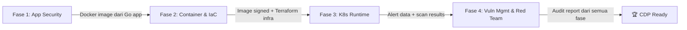

# 🛡️ 60 Days DevSecOps Mastery — Project-Based Curriculum

## Nama Proyek: **"SecureBank API"**

> Sebuah REST API perbankan sederhana (transfer, cek saldo, riwayat transaksi) berbasis **Golang** yang akan diamankan secara bertahap dari kode mentah hingga production-grade di Kubernetes — menjadi satu narasi proyek utuh yang tidak terputus.

---

## 🎯 Filosofi Kurikulum

Seluruh 60 hari menggunakan **satu proyek yang sama** (`SecureBank API`) sehingga setiap hari membangun di atas hasil hari sebelumnya. Tidak ada proyek terpisah — semua saling terhubung:

```
Kode Go → Pipeline CI/CD → Container → Terraform Infra → Kubernetes → Monitoring → Red Team → Audit
```

## 📖 Referensi Pemula

Bagi Anda yang baru terjun ke dunia DevSecOps dan merasa asing dengan istilah teknis (seperti CI/CD, Pipeline, SAST, DAST, dll), sangat disarankan untuk membaca **[Glosarium Istilah Asing & Teknis](docs/istilah-asing.md)** terlebih dahulu agar proses belajar lebih mudah dipahami.

## 📋 Prasyarat

| Komponen | Minimum |
|----------|---------|
| OS | macOS / Linux (WSL2 untuk Windows) |
| Go | v1.22+ |
| Docker | v24+ dengan Docker Compose |
| Git | v2.40+ |
| kubectl | v1.28+ |
| Helm | v3.14+ |
| Terraform | v1.7+ |
| IDE | VS Code dengan Go extension |
| Cloud | AWS Free Tier atau GCP Free Tier (sandbox) |
| CI/CD | GitHub account (GitHub Actions) |

## 🗂️ Struktur Repositori Akhir

```
securebank-api/
├── cmd/api/main.go                  # Entry point aplikasi
├── internal/
│   ├── handler/                     # HTTP handlers
│   ├── middleware/                  # Auth, logging, security headers
│   ├── model/                      # Data models
│   ├── repository/                 # Database layer
│   └── service/                    # Business logic
├── pkg/crypto/                     # Utility kriptografi
├── configs/                        # App config files
├── Dockerfile                      # Multi-stage build
├── docker-compose.yml              # Local dev stack
├── Makefile                        # Command shortcuts
├── .github/workflows/
│   ├── ci.yml                      # Main CI pipeline
│   ├── security-scan.yml           # Security scanning pipeline
│   └── infra.yml                   # Infrastructure pipeline
├── terraform/
│   ├── main.tf                     # VPC, EKS/GKE, S3
│   ├── variables.tf
│   ├── outputs.tf
│   └── modules/
├── k8s/
│   ├── deployment.yaml
│   ├── service.yaml
│   ├── ingress.yaml
│   ├── network-policy.yaml
│   ├── rbac.yaml
│   └── gatekeeper/
│       ├── constraint-templates/
│       └── constraints/
├── security/
│   ├── falco-rules/
│   ├── inspec-profiles/
│   ├── threat-model/
│   └── audit-reports/
├── .gitleaks.toml                  # Gitleaks config
├── .semgrep.yml                    # Custom Semgrep rules
├── .trivyignore                    # Trivy exceptions
└── docs/
    ├── fase-1-appsec.md
    ├── fase-2-infra-container.md
    ├── fase-3-k8s-runtime.md
    ├── fase-4-vuln-redteam.md
    └── istilah-asing.md
```

---

## Fase 1: Secure SDLC & Application Security (Hari 1–15)

> **Tujuan:** Membangun aplikasi SecureBank API, pipeline CI/CD, dan memasang lapisan keamanan kode (Secret Scan, SCA, SAST).

Detail lengkap: [fase-1-appsec.md](docs/fase-1-appsec.md)

| Hari | Topik | Output Konkret |
|------|-------|----------------|
| 1 | Setup Repo & Golang API | `main.go` dengan 3 endpoint + unit test berjalan |
| 2 | Pipeline CI/CD Dasar | `ci.yml` — auto build & test on push |
| 3 | Secret Scanning (Gitleaks) | Gitleaks berjalan lokal, `.gitleaks.toml` dikonfigurasi |
| 4 | Secret Scan di Pipeline + Remediasi | Job Gitleaks di CI, kredensial dipindah ke env vars |
| 5 | SCA Setup (Trivy FS) | `trivy fs .` menemukan CVE di `go.mod` |
| 6 | SCA di Pipeline (Gate) | Job Trivy gagalkan build jika ada CVE CRITICAL |
| 7 | SCA Remediation | `go get -u` patch dependensi, pipeline hijau |
| 8 | SAST Setup (Semgrep) | Semgrep lokal menemukan insecure crypto & SQL injection |
| 9 | SAST di Pipeline (Gate) | Job Semgrep blokir PR jika severity HIGH |
| 10 | SAST Remediation | Fix md5→sha256, parameterized query, pipeline hijau |
| 11 | AI-Assisted Code Audit | Output Trivy/Semgrep → AI → perbaikan diterapkan |
| 12 | Pipeline Optimization | Cache Go modules, parallel jobs, total < 2 menit |
| 13 | Threat Modeling (STRIDE) | Diagram arsitektur + tabel ancaman di `threat-model/` |
| 14 | Intentional Vuln Test | Commit fake secret → Gitleaks gagalkan build → revert |
| 15 | Dokumentasi Fase 1 | `fase-1-appsec.md` — cara kerja SAST, SCA, Secret Scan |

---

## Fase 2: Infrastructure as Code & Container Security (Hari 16–30)

> **Tujuan:** Kontainerisasi SecureBank API, hardening Docker, setup Terraform untuk cloud infra, dan DAST.

Detail lengkap: [fase-2-infra-container.md](docs/fase-2-infra-container.md)

| Hari | Topik | Output Konkret |
|------|-------|----------------|
| 16 | Dockerfile Multi-stage | Build di `golang:alpine`, run di `distroless` |
| 17 | Container Image Scan | `trivy image securebank:v1` — daftar CVE base image |
| 18 | Dockerfile Hardening | `USER nonroot`, `COPY --chown`, read-only filesystem |
| 19 | Image Signing (Cosign) | Key pair + signed image di registry |
| 20 | Terraform Setup + IaC Scan (Checkov) | `terraform/main.tf` (VPC+S3) + `checkov -d .` |
| 21 | IaC Scan (tfsec/Trivy) | Scan ulang dengan tfsec, bandingkan temuan |
| 22 | IaC di Pipeline | Job Checkov gagalkan build jika SG terbuka 0.0.0.0/0 |
| 23 | IaC Remediation | Enkripsi S3, perketat SG rules, pipeline hijau |
| 24 | DAST Setup (OWASP ZAP) | ZAP Baseline Scan ke `localhost:8080` |
| 25 | DAST di Pipeline | Job ZAP scan staging setelah deploy |
| 26 | DAST Remediation | Tambah security headers di Go middleware |
| 27 | AI-Assisted IaC Fix | Terraform rentan → AI → versi aman diterapkan |
| 28 | Compliance as Code (InSpec) | Profile InSpec: verifikasi port 22 tertutup |
| 29 | Pipeline Consolidation | Satu YAML: Secret+SAST+SCA+Image+IaC scan paralel |
| 30 | Dokumentasi Fase 2 | `fase-2-infra-container.md` |

---

## Fase 3: Kubernetes & Runtime Security (Hari 31–45)

> **Tujuan:** Deploy SecureBank API ke K8s (k3d), hardening cluster, policy enforcement, dan runtime monitoring.

Detail lengkap: [fase-3-k8s-runtime.md](docs/fase-3-k8s-runtime.md)

| Hari | Topik | Output Konkret |
|------|-------|----------------|
| 31 | K8s Cluster + Deploy | k3d cluster + `kubectl apply` deployment & service |
| 32 | K8s Misconfiguration Scan | Kubesec/Checkov scan `deployment.yaml` |
| 33 | SecurityContext Hardening | `readOnlyRootFilesystem`, `allowPrivilegeEscalation: false` |
| 34 | OPA Gatekeeper Setup | Helm install Gatekeeper di cluster |
| 35 | Rego Policy Writing | Policy: tolak Pod tanpa resource limits |
| 36 | OPA Policy Testing | Deploy Pod tanpa limits → "Denied by Gatekeeper" |
| 37 | Network Policies | Default Deny All + whitelist Ingress traffic |
| 38 | RBAC Auditing | `kubectl who-can` audit, hapus overprivileged SA |
| 39 | Falco Setup | Helm install Falco, verifikasi logs berjalan |
| 40 | Falco Custom Rules | Rule: alert jika `bash`/`sh` dijalankan di container |
| 41 | Falco Attack Simulation | `kubectl exec` → cek Falco log Notice/Warning |
| 42 | Alerting Webhook (n8n) | n8n workflow: webhook trigger untuk alert Falco |
| 43 | K8s Secret Management | External Secrets Operator → AWS Secrets Manager |
| 44 | AI Threat Modeling K8s | Topologi + RBAC → AI analisis 3 attack path |
| 45 | Dokumentasi Fase 3 | `fase-3-k8s-runtime.md` |

---

## Fase 4: Vulnerability Management & Red Teaming (Hari 46–60)

> **Tujuan:** Dashboard terpusat, automasi respons, red team simulation, dan persiapan sertifikasi CDP.

Detail lengkap: [fase-4-vuln-redteam.md](docs/fase-4-vuln-redteam.md)

| Hari | Topik | Output Konkret |
|------|-------|----------------|
| 46 | DefectDojo Setup | Docker Compose up, login dashboard |
| 47 | DefectDojo API Integration | Pipeline upload Trivy+Semgrep JSON ke DefectDojo |
| 48 | Alert Routing (n8n) | CRITICAL alert → Slack Security channel |
| 49 | AI Remediation Node | n8n + LLM: auto-ringkas SAST finding → Slack dev |
| 50 | CSPM (Prowler/ScoutSuite) | Scan AWS/GCP sandbox vs CIS Benchmarks |
| 51 | CSPM Remediation | Fix 3 temuan kritis (MFA, S3 bucket, stale keys) |
| 52 | Red Team: K8s Escape | Privileged pod → host filesystem → Falco/OPA deteksi |
| 53 | Red Team: Leaked Creds | IAM user sementara → CloudTrail → auto-revoke script |
| 54 | Chaos Security Engineering | Kill OPA webhook → deploy vulnerable app → alarm? |
| 55 | Laporan Audit | Export DefectDojo → Executive Summary draft |
| 56 | Dokumen Eksekutif (PDF) | PDF formal: metodologi, temuan, mitigasi, sisa risiko |
| 57 | AI Review Dokumen | AI periksa struktur & nada bahasa laporan audit |
| 58 | CDP Exam Sim: Lab Setup | Wipe semua config, siapkan app mentah |
| 59 | CDP Exam Sim: Execution | 3 jam: rebuild semua pipeline dari nol |
| 60 | Project Showcase | Diagram arsitektur E2E + publikasi final |

---

## 🔗 Peta Koneksi Antar Fase



**Benang merah proyek:**
1. **SecureBank API** ditulis di Fase 1 → menjadi target scan di semua fase
2. **Pipeline CI/CD** dibangun di Fase 1 → ditambah jobs di Fase 2–4
3. **Docker image** di-build Fase 2 → di-deploy ke K8s di Fase 3
4. **Terraform infra** di Fase 2 → menjadi target IaC scan & CSPM
5. **Falco alerts** di Fase 3 → dikirim ke n8n/Slack di Fase 4
6. **Semua hasil scan** → masuk DefectDojo di Fase 4 → jadi laporan audit

---

> 📖 Lihat detail tutorial harian di masing-masing file fase di folder `docs/`.
